.. _app_control_arduino:

APP Control
============

In this chapter, you will learn to use a APP - Sunfounder Controller to control the car.

The complete operation process is as follows：**Install Sunfounder Controller** -> **Establish Communication** -> **Control the Car with APP**.

You can check the **About Sunfounder Controller** and **DIY Controller** sections according to your choice.

* :ref:`install_sunfounder_controller`
* :ref:`about_sunfounder_controller`
* :ref:`establish_communication`
* :ref:`control_the_car_with_app`
* :ref:`diy_controller` 

.. _install_sunfounder_controller:

Install Sunfounder Controller
-------------------------------

Open App Store (iOS/Mac OS X system) or Play Store (Android/Windows/Linux system), then search and download Sunfounder Controller.

.. image:: img/arduino_app1.png
  :align: center

.. _about_sunfounder_controller:

About Sunfounder Controller
-----------------------------

Page Introduction
^^^^^^^^^^^^^^^^^^

Start the Sunfounder Controller.

Click the middle button to add a new controller.

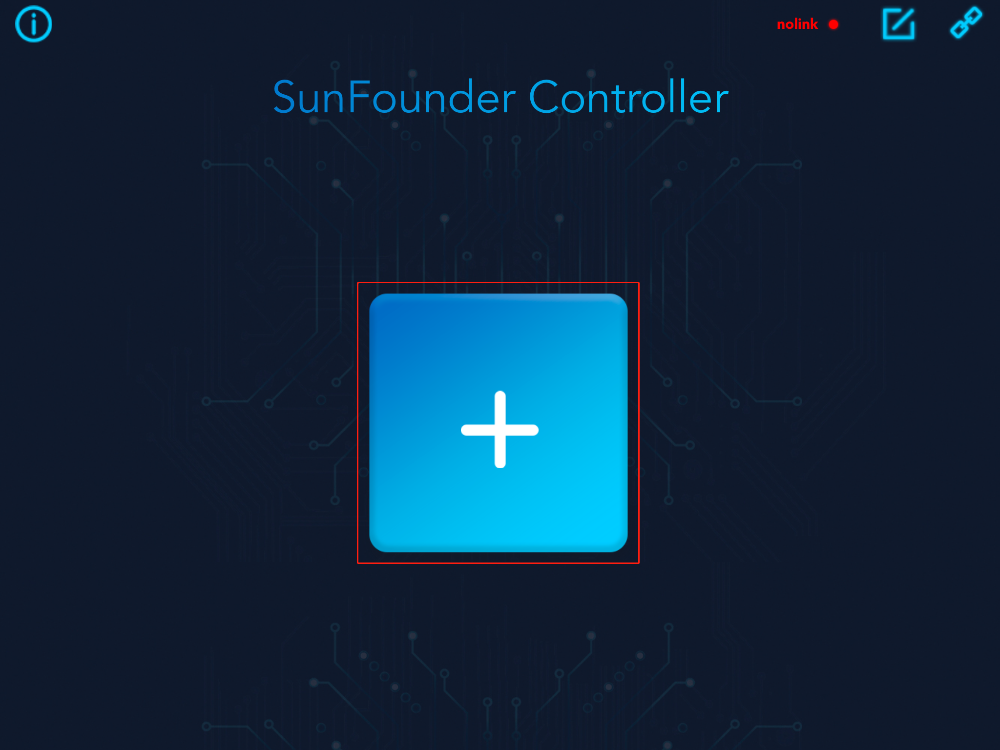

Sunfounder Controller is a platform that can add custom controllers. It
reserves many widget interfaces. There are a total of 17 areas from A to Q. Each area
has selectable widgets.

.. image:: img/arduino_app4.png
  :width: 450
  :align: center

The available widgets in the **large square area** include joystick and D-Pad.

.. image:: img/arduino_app5.png
  :width: 400
  :align: center

The available widgets in the **small square area** include button, digital display and switch.

.. image:: img/arduino_app6.png
  :width: 360
  :align: center

The available widgets for the **rectangular area** include slider, dial, ultrasonic radar and grayscale detection tool.

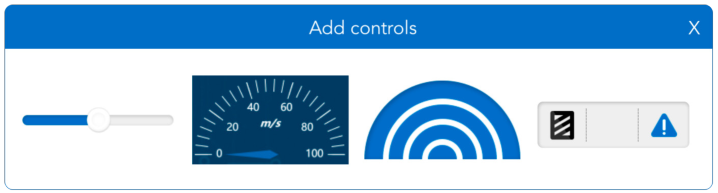

Widgets List
^^^^^^^^^^^^

Here, you will learn the parameter types and ranges of control widgets and data widgets.

**Control Widgets**

The control widgets of Sunfounder Controller include buttons, switches, joystick, D-Pad, and slider.

You can modify the name, parameter range and initial value of some widgets by clicking the settings button in the upper right corner

.. image:: img/arduino_app8.png
  :width: 550
  :align: center

When we use these control widgets, ESP-4WD car will receive the control data.
Through these control data, we can write code to control the car.

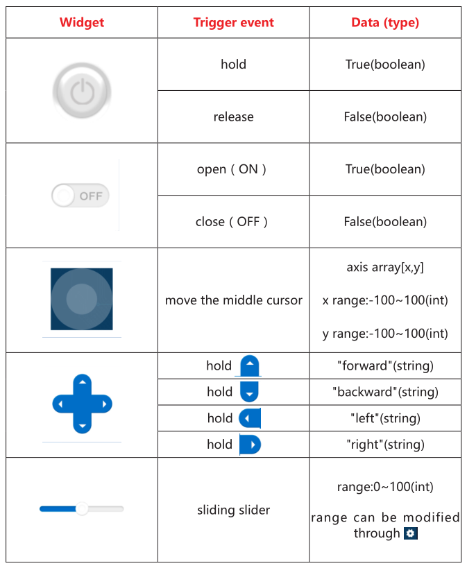

**Data Widgets**

The data widget of Sunfounder Controller includes digital displays, dial, ultrasonic
radar, and grayscale detection tool.

When we send sensor data to these data widgets, we can show the data on the
corresponding widgets. At the same time, you can also modify the name, unit and
parameter range of the data widget by clicking the setting icon in the upper right
corner.

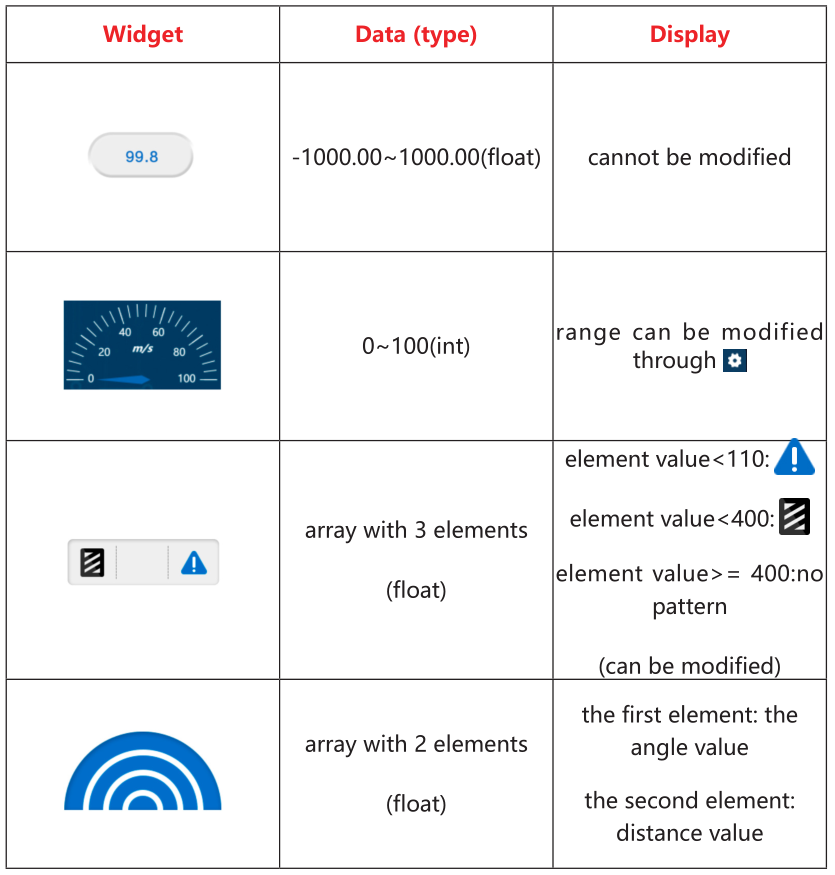

.. _establish_communication:

Establish Communication
------------------------

There are two ways to establish communication between Sunfounder Controller and ESP-4WD car: One is AP mode, the other is STA mode.

* **AP Mode**: You need to connect Sunfounder Contorller to the hotspot released by ESP-4WD car.
* **STA Mode**: You need to connect Sunfounder Controller and ESP-4WD car to the same LAN. 

We can switch the communication mode by modifying the code ``8.app_control.ino`` under the path ``esp-4wd\Arduino\esp_rdp\examples\8.app_control`` and defining the ``SWITCH_MODE`` variable as ``ap`` or ``sta``.

.. code-block:: c

    #define SWITCH_MODE "ap"

AP Mode
^^^^^^^^

If you want to use AP mode, you need to connect Sunfounder Contorller to the hotspot released by ESP-4WD car. 

1. Open the code ``8.app_control.ino``, modify the NAME and AP_PASSWORD to yours. 

.. code-block:: c

    #define NAME "ESP-4WD Car"
    #define AP_PASSWORD "123456789"

.. note::
  The NAME in the code is both the SSID and the name of the car, if you have more than one EPS-4WD Car, you need to set different NAMEs for them to avoid a wrong connection. 

  In addition, you need to set a password of more than 8 digits.
  

2. Then define the ``SWITCH_MODE`` variable as ``ap``.

.. code-block:: c

    #define SWITCH_MODE "ap"

3. After downloading the code, ESP-4WD car will send a hotspot signal, then take out your
mobile device, open the WLAN management interface and connect to the wifi network.

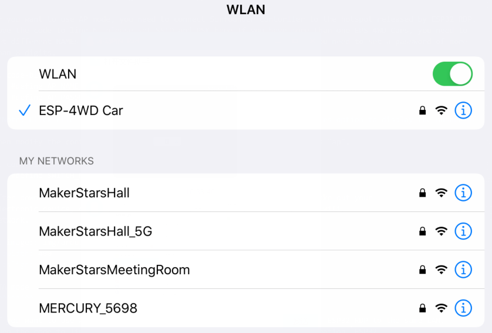

4. Open **Sunfounder Controller** and click the **Connect** icon on the top right corner.

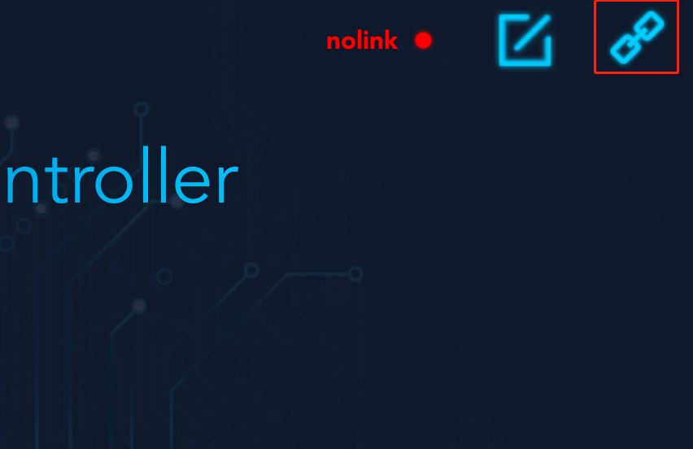

5. A prompt box will appear if the connection is successful.

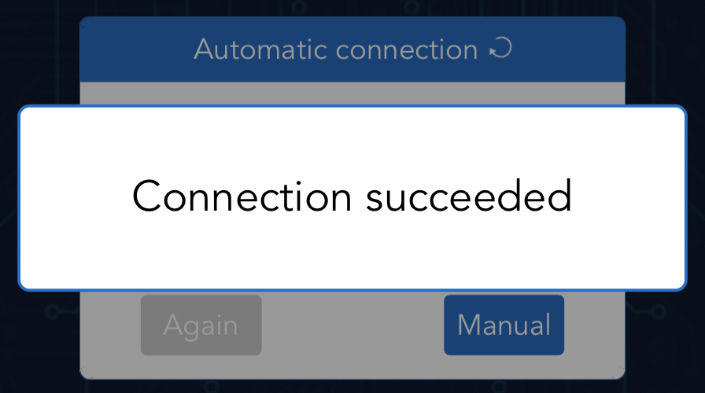

6. And the name of the car will be shown on APP.

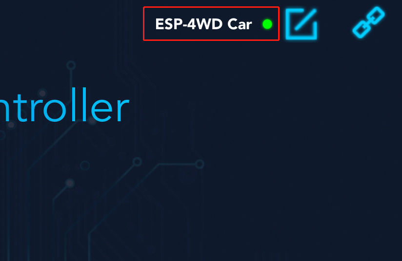

STA Mode
^^^^^^^^^

If you want to use STA mode, you need to connect Sunfounder Controller and ESP-4WD car to the same LAN.

1. Open the code ``8.app_control.ino``, modify the STA_NAME and STA_PASSWORD to yours.

.. code-block:: c

    #define STA_NAME "MakerStarsHall"
    #define STA_PASSWORD "sunfounder"

2. Then define the ``SWITCH_MODE`` variable as ``sta``.

.. code-block:: c

    #define SWITCH_MODE "sta"

3. After downloading the code, ESP-4WD car will automatically connect to the wifi network, and at the same time take out your mobile device, open the WLAN management interface 
and connect to this wifi network.

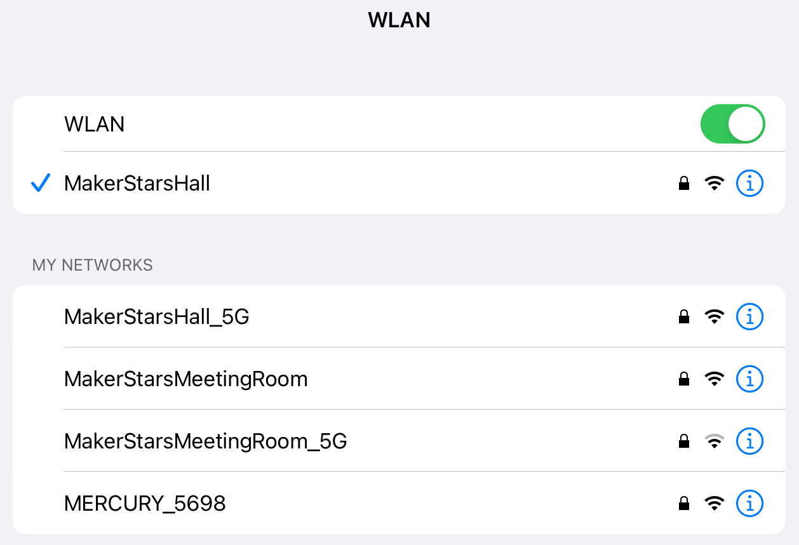

4. Open Sunfounder Controller and click the **Connect** icon on the top right corner.

5. Find the car name in the pop-up window and click on it.

.. image:: img/arduino_app_new4.png
  :width: 450
  :align: center

6. After connecting, the name of the car will be showed on APP.

.. _control_the_car_with_app:

Control the Car with APP
---------------------------

Either way, you can get the SunFounder Controller and ESP-4WD car to establish communication, next you will learn how to control the car with APP.

1. Open Sunfounder Controller, click the **+** to create an empty controller.

2. As shown in the figure, select the corresponding widget and click the icon in the upper right corner to save.

* **Widget A**: Show the driving speed of the car.
* **Widget D**: Simulate radar scanning.
* **Widget H**: Control the driving speed of the car.
* **Widget K**: Control the driving direction of the car.
* **Widget L**: Show the detection result of the grayscale sensor.
* **Widget M**: Control the on and off of the RGB board.
  
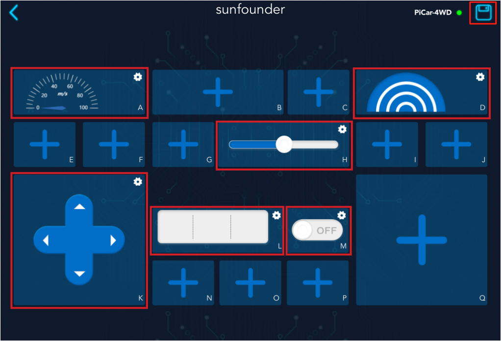

3. Click the start button in the upper right corner, and then try to use these widgets to control ESP-4WD car.

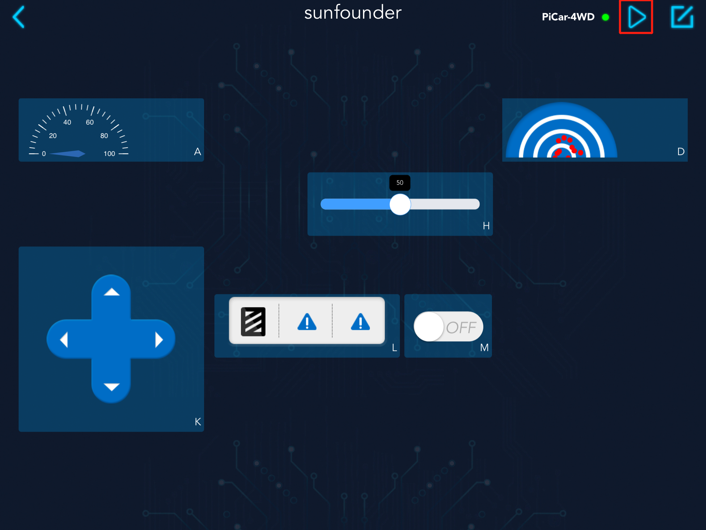

.. _diy_controller:

DIY Controller
-----------------------

If you want to DIY a new controller, you need to understand the communication process between the ESP-4WD car and the Sunfounder Controller. Open the 
``9.test_control.ino`` file under the path ``esp-4wd\Arduino\esp_rdp\examples\9.test_control``. You will go through this code to see how they communicate with each other.

Program framework
^^^^^^^^^^^^^^^^^^^

First, let us understand the general operating framework of the program.

Turn the code to line 103. In ``setup()``, the temp_data variable defines the device
information and proofreading information of ESP-4WD car, and sends it to
Sunfounder Controller through the ``deserializeJson()`` function.

.. code-block:: c

    void setup() {
        String stringone = "{\'Name\':\"";
        String stringtwo = "\", \'Type\':\"ESP-4WD Car\", \'Check\':\"SunFounder Controller\"}";
        temp_data = stringone + String(AP_NAME) + stringtwo;
        deserializeJson(doc_send, temp_data);

This ``if`` statement is used to determine the communication mode between ESP-4WD car and Sunfounder Controller. You can change the communication mode by modifying
``SWITCH_MODE``.

.. code-block:: c

    if(SWITCH_MODE == "ap")
    {
        WiFi.softAP(AP_NAME, AP_PASSWORD);
        ...  
    }
    else if(SWITCH_MODE == "sta")
    {
        WiFi.begin(STA_NAME, STA_PASSWORD);
        ...
    }

These two lines of statements indicate that the APP service starts running and enters
the event processing process.

.. code-block:: c

    webSocket.begin(); 
    webSocket.onEvent(onWebSocketEvent);

Then, we turn the code to line 26, ``onWebSocketEvent()`` is the event handling function,
which uses the switch statement to determine the event type. The event types that
the current program can trigger are ``WStype_DISCONNECTED``, ``WStype_CONNECTED``,
and ``WStype_TEXT``.

* ``WStype_DISCONNECTED`` is a disconnected event. The processing method is to print the disconnected information.
* ``WStype_CONNECTED`` is a connected event. The processing method is to print the connection information, and then send the device information to Sunfounder Controller.
* ``WStype_TEXT`` is a sending and receiving event, and we will process the received and sent string information in this event.

.. code-block:: c

    void onWebSocketEvent(uint8_t client_num,
                        WStype_t type,
                        uint8_t * payload,
                        size_t length) {
    char output[300];
    // Figure out the type of WebSocket event
    switch(type) {

        // Client has disconnected
        case WStype_DISCONNECTED:
        Serial.printf("[%u] Disconnected!\n", client_num);
        break;

        // New client has connected
        case WStype_CONNECTED:
        {
            IPAddress ip = webSocket.remoteIP(client_num);
            Serial.printf("[%u] Connection from ", client_num);
            Serial.println(ip.toString());
            webSocket.sendTXT(client_num, temp_data);
        }
        break;

        case WStype_TEXT:
            ...

By modifying the content of the ``WStype_TEXT`` event, we can understand the data receiving and sending process between ESP-4WD car and Sunfounder Controller.

Receiving
^^^^^^^^^^^^^^^^^^^^^^^^^^^

The ESP-4WD car receives data from the Sunfounder Controller and sends its own sensor data to the Sunfounder Controller.
Let's find out the data received by ESP-4WD car from Sunfounder Controller.

**Step 1: Create new controller**

Run the code, ``9.test_control.ino``, re-establish communication, and then open Sunfounder Controller to create a new controller.
We add a slider in the H area and a D-Pad in the K area. After adding, click the icon in the upper right corner to save.

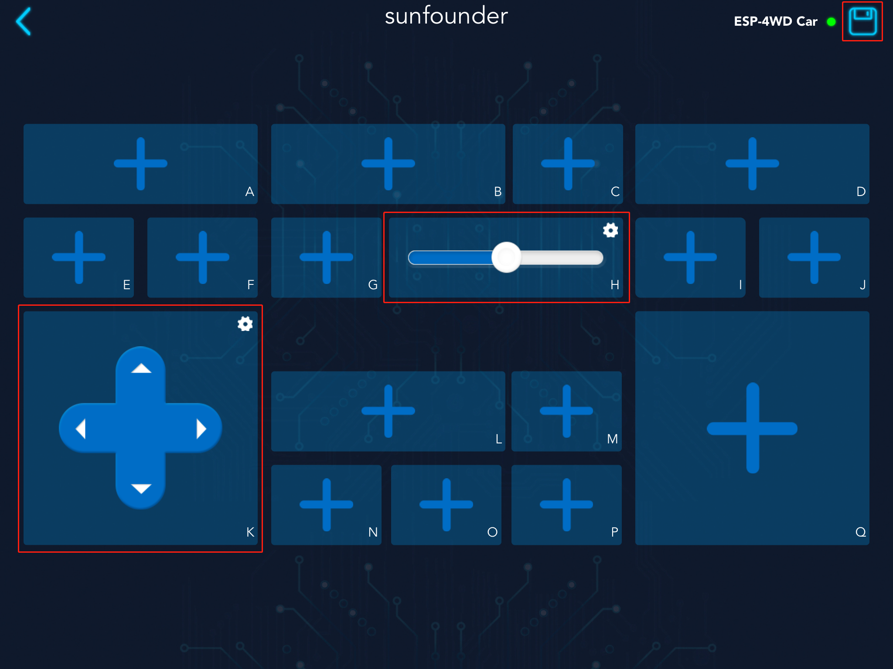

**Step 2: Receive data from SunFounder Controller**

Turn the code to line 53, in this ``if`` statement, we print out the string data (payload variable) received from Sunfounder Controller.

.. code-block:: c

    if(strcmp((char * )payload, temp_recv) != 0) 
    {
        memset(temp_recv, 0, 300);
        Serial.printf(" Received text: %s\n", payload);
        memcpy(temp_recv, (char *)payload, strlen((char *)payload));
    }

Click the start icon in the upper right corner to run the SunFounder Controller.

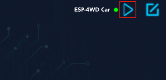

Open the Serial  Monitor of arduino, we can find that the initial data of K
control is the string ``stop``, and the initial data of H widget is the int value 50.

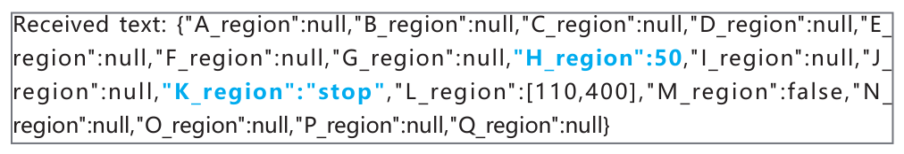

Press the arrow keys of the **D-Pad** in the K area and slide the **slider** in the H area.

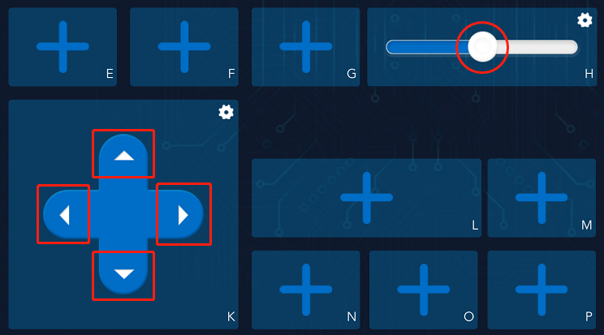

You can see that the D-Pad widget sends a string of data ("forward", "backward", "left", "right") to the ESP-
4WD car, while the slider widget will send an int data (range: 0-100).

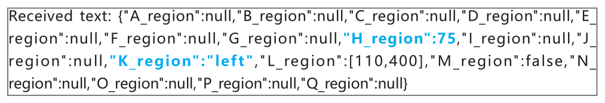

**Step 3: Responding**

When ESP-4WD car receives data from Sunfounder Controller, it needs to respond accordingly.

By modifying the content of the ``WStype_TEXT`` event, we can use the Sunfounder Controller widget to control the movement of the car.
The K widget(D-Pad) controls the direction of the car, and the H widget(slider) controls the speed of the car.

Add the following code to line 62(a blank line).

.. code-block:: c

    car.move(doc_recv["K_region"], doc_recv["H_region"]);

After adding it, the content of the ``WStype_TEXT`` event is as follows. There are some commented contents not shown, please don't remove them.

.. code-block:: c
  :emphasize-lines: 8,9

  case WStype_TEXT:
      if(strcmp((char * )payload, temp_recv) != 0) 
      {
          memset(temp_recv, 0, 300);
          Serial.printf(" Received text: %s\n", payload);
          memcpy(temp_recv, (char *)payload, strlen((char *)payload));
      }
      deserializeJson(doc_recv, payload);
      car.move(doc_recv["K_region"], doc_recv["H_region"]);
      serializeJson(doc_send, output);
      if(strcmp(output, temp_send) != 0) 
      {
          memset(temp_send, 0, 300);
          Serial.printf(" Send text: %s\n", output);
          memcpy(temp_send, output, strlen(output));
        }
      webSocket.sendTXT(client_num, output);     
      break;

* Before we understand the content of the ``WStype_TEXT`` event, please go to line 19, where there is a global variable ``doc_recv`` that can store the defined json object (similar to the structure of the C language) for receiving string data from Sunfounder Controller.

  .. code-block:: c

      DynamicJsonDocument doc_recv(1024);

* Go back to ``WStype_TEXT`` event, through the function ``deserializeJson( )``, the variable ``payload`` (the string data received from the Sunfounder Controller) is converted into an operable variable ``doc_recv``.

  .. code-block:: c

      deserializeJson(doc_recv, payload);

* The value of ``doc_recv["K_region"]`` is the string data ("forward", "backward","left","right") sent by the K widget (D-Pad), the same as the value of ``doc_recv["H_region"]`` is the int data sent by H widget (slide) (range: 0-100).

* Pass ``doc_recv["K_region"]`` as the first parameter to the ``car.move()`` function to control the direction of the ESP-4WD car. Pass ``doc_recv["H_region"]`` as the second parameter to the ``car.move()`` function to control the speed.

  .. code-block:: c

      car.move(doc_recv["K_region"], doc_recv["H_region"]);

After downloading the modified code and re-establishing communication, open the controller and click the start icon in the upper right corner to run the controller.

The D-Pad in the K area can control the direction of the ESP-4WD car, and the slider in the H area can control the speed.

Sending
^^^^^^^^^

Let's take a closer look at how the ESP-4WD car sends its own sensor data to the Sunfounder Controller.

**Step 1: Create new controller**

Go back to ``WStype_TEXT`` event, cancel the comment in lines 67-71, to enable this code.

.. code-block:: c

    car.get_grayscale();
    for(int i = 0; i < 3; i++)
    {
        doc_send["L_region"][i] = car.adc_value[i];
    }

Download this code, re-establish communication, and then open Sunfounder Controller to create a new controller. We add a grayscale detection tool in the L area. After adding, click the icon in the upper right corner to save.

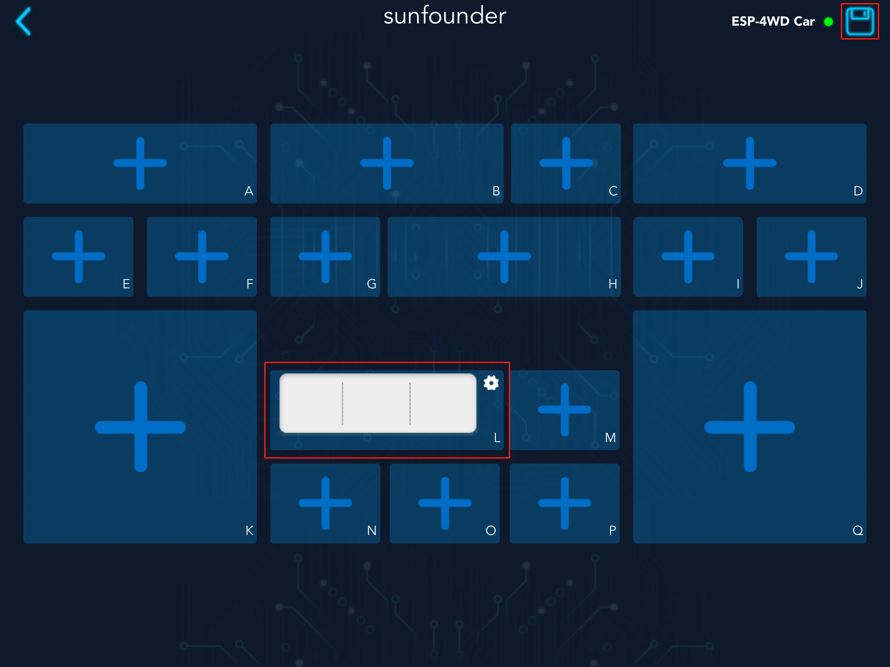

**Step 2: Send sensor data to SunFounder Controller**

Turn the code to line 77. In this if statement, we print the variable ``output`` (the string information that stores the sensor data).

.. code-block:: c

    if(strcmp(output, temp_send) != 0) 
    {
        memset(temp_send, 0, 300);
        Serial.printf(" Send text: %s\n", output);
        memcpy(temp_send, output, strlen(output));
    }

Click the start icon in the upper right corner to run the controller.

Open the Serial Monitor of Arduino, you will see that ESP-4WD car has sent device information, calibration information and grayscale sensor values ​​to the Sunfounder Controller.

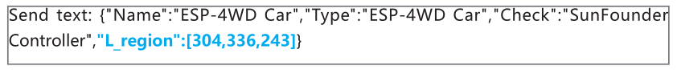

**Step 3: Responding**

Let's write a piece of code that show the sensor data of ESP-4WD car on the widget of Sunfounder Controller. Widget L (grayscale detection tool) will show you the grayscale of the ground.

Let's re-explain the content of the ``WStype_TEXT`` event. 

.. code-block:: c
  :emphasize-lines: 10,11,12,13,14,15,16,17,18,19,20,21,22,23

  case WStype_TEXT:
      if(strcmp((char * )payload, temp_recv) != 0) 
      {
          memset(temp_recv, 0, 300);
          Serial.printf(" Received text: %s\n", payload);
          memcpy(temp_recv, (char *)payload, strlen((char *)payload));
      }
      deserializeJson(doc_recv, payload);
      car.move(doc_recv["K_region"], doc_recv["H_region"]);
      car.get_grayscale();
      for(int i = 0; i < 3; i++)
      {
          doc_send["L_region"][i] = car.adc_value[i];
      }
      serializeJson(doc_send, output);
      if(strcmp(output, temp_send) != 0) 
      {
          memset(temp_send, 0, 300);
          Serial.printf(" Send text: %s\n", output);
          memcpy(temp_send, output, strlen(output));
      }
      webSocket.sendTXT(client_num, output);     
      break;

* Before we understand the content of the ``WStype_TEXT`` event, please go to line 18, where the global variable ``doc_send`` defines an object that can store json objects(similar to the structure of the c language) for sending sensor data to the Sunfounder Controller.

  .. code-block:: c

      DynamicJsonDocument doc_send(1024);

* Go back to the ``WStype_TEXT`` event, the ``car.get_grayscale()`` function is used to get the detection values of the three probes of the grayscale module. From left to right, they are ``car.adc_value[0]`` , ``car.adc_value[1]`` and ``car.adc_value[2]`` , which are stored in ``doc_send["L_region"]``.

  .. code-block:: c

      car.get_grayscale();
      for(int i = 0; i < 3; i++)
      {
          doc_send["L_region"][i] = car.adc_value[i];
      }

* Use the function ``serializeJson()`` to convert the variable ``doc_send`` (the stored sensor data) to the variable ``output`` (which is a string type recognized by the Sunfounder Controller).

  .. code-block:: c

      serializeJson(doc_send, output);

* Then send the variable ``client_num`` (storing the device information and proofreading information of the ESP-4WD car) and variable ``output`` to Sunfounder Controller.

  .. code-block:: c

      webSocket.sendTXT(client_num, output); 

Now, open the SunFounder Controller again, Widget D (grayscale detection tool) is showing the current ground conditions.

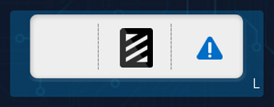

