.. _app_control_micropython:

APP Control
============

In this chapter, you will learn to use a APP - Sunfounder Controller to control the car.

The complete operation process is as follows：**Install Sunfounder Controller** -> **Establish Communication** -> **Control the Car with APP**.

You can check the **About Sunfounder Controller** and **DIY Controller** sections according to your choice.

* :ref:`micropython_install_sunfounder_controller`
* :ref:`micropython_about_sunfounder_controller`
* :ref:`micropython_establish_communication`
* :ref:`micropython_control_the_car_with_app`
* :ref:`micropython_diy_controller` 

.. _micropython_install_sunfounder_controller:

Install Sunfounder Controller
-------------------------------

Open App Store (iOS/Mac OS X system) or Play Store (Android/Windows/Linux system), then search and download Sunfounder Controller.

.. image:: img/arduino_app1.png
  :align: center

.. _micropython_about_sunfounder_controller:

About Sunfounder Controller
-----------------------------

Page Introduction
^^^^^^^^^^^^^^^^^^

Start the Sunfounder Controller.

.. image:: img/arduino_app2.png
  :width: 150
  :align: center

Click the middle button to add a new controller.

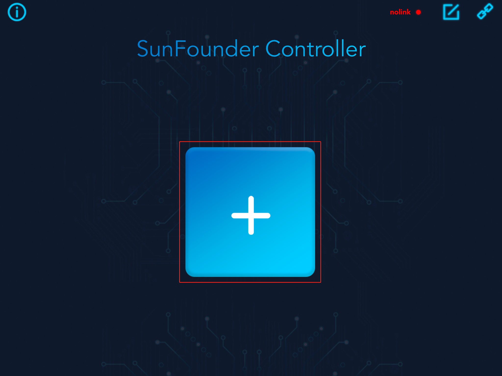

Sunfounder Controller is a platform that can add custom controllers. It
reserves many widget interfaces. There are a total of 17 areas from A to Q. Each area
has selectable widgets.

.. image:: img/arduino_app4.png
  :width: 450
  :align: center

The available widgets in the **large square area** include joystick and D-Pad.

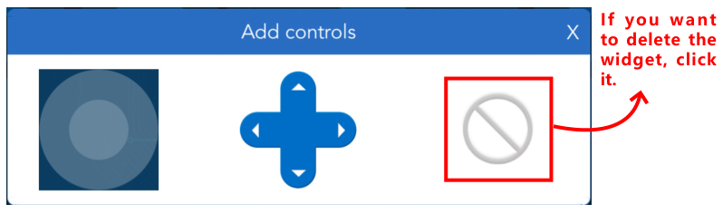

The available widgets in the **small square area** include button, digital display and switch.

.. image:: img/arduino_app6.png
  :width: 360
  :align: center

The available widgets for the **rectangular area** include slider, dial, ultrasonic radar and grayscale detection tool.

.. image:: img/arduino_app7.png
  :width: 510
  :align: center

Widgets List
^^^^^^^^^^^^

Here, you will learn the parameter types and ranges of control widgets and data widgets.

**Control Widgets**

The control widgets of Sunfounder Controller include buttons, switches, joystick, D-Pad, and slider.

You can modify the name, parameter range and initial value of some widgets by clicking the settings button in the upper right corner.

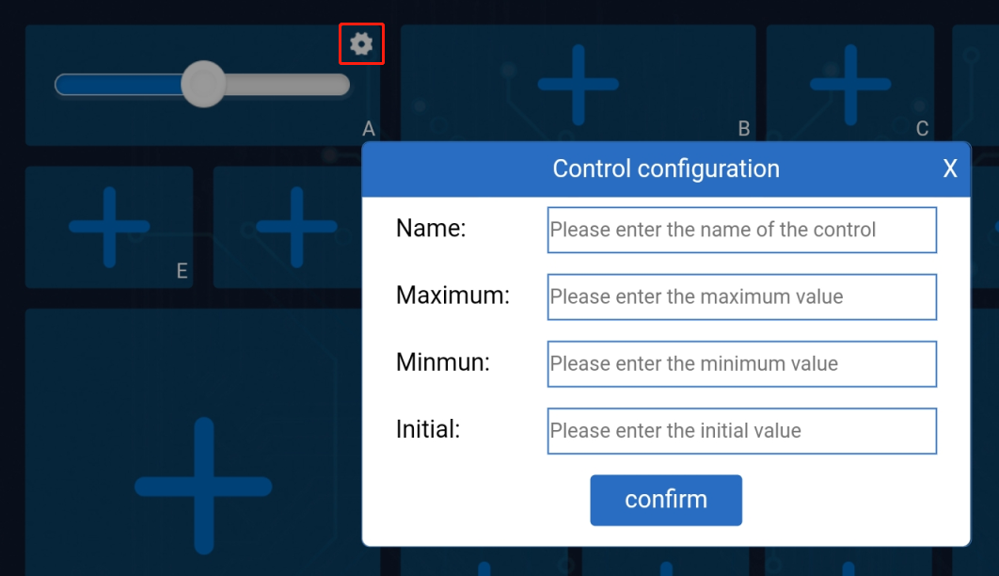

When we use these control widgets,  proofreading information of the ESP-4WD car will receive the control data.
Through these control data, we can write code to control the car.

.. image:: img/arduino_app9.png
  :width: 700
  :align: center

**Data Widgets**

The data widget of Sunfounder Controller includes digital displays, dial, ultrasonic
radar, and grayscale detection tool.

When we send sensor data to these data widgets, we can show the data on the
corresponding widgets. At the same time, you can also modify the name, unit and
parameter range of the data widget by clicking the setting icon in the upper right
corner.

.. image:: img/arduino_app10.png
  :width: 700
  :align: center

.. _micropython_establish_communication:

Establish Communication
------------------------
  
There are two ways to establish communication between Sunfounder Controller and ESP-4WD car: One is AP mode, the other is STA mode.
  
* **AP Mode**: You need to connect Sunfounder Contorller to the hotspot released by ESP-4WD car.
* **STA Mode**: You need to connect Sunfounder Controller and ESP-4WD car to the same LAN. 

We can switch the communication mode by modifying the code ``ws.py`` and defining the ``SWITCH_MODE`` variable as ``ap`` or ``sta``.

  .. code-block:: python

    SWITCH_MODE = "ap"

AP Mode
^^^^^^^^

If you want to use AP mode, you need to connect Sunfounder Contorller to the hotspot released by ESP-4WD car. 

1. Open the code ``ws.py``, modify the NAME and AP_PASSWORD to yours. 

  .. code-block:: python

    NAME = 'ESP-4WD Car'
    AP_PASSWORD = "123456789"

.. note::
  The NAME in the code is both the SSID and the name of the car, if you have more than one EPS-4WD car, you need to set different NAMEs for them to avoid a wrong connection. 

  In addition, you need to set a password of more than 8 digits.
  

2. Then define the ``SWITCH_MODE`` variable as ``ap``.

  .. code-block:: python

    SWITCH_MODE = "ap" 

3. After downloading the code, ESP-4WD car will send a hotspot signal, then take out your
mobile device, open the WLAN management interface and connect to the wifi network.

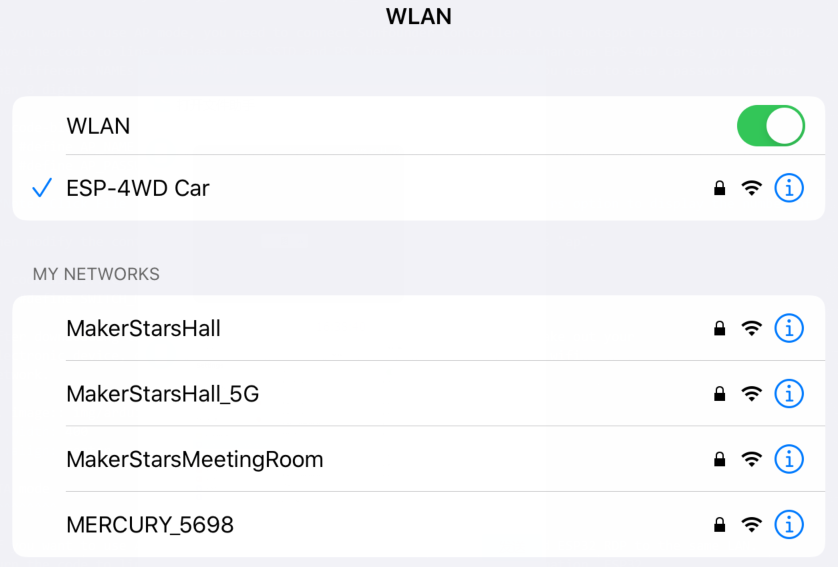

4. Open **Sunfounder Controller** and click the **Connect** icon on the top right corner.

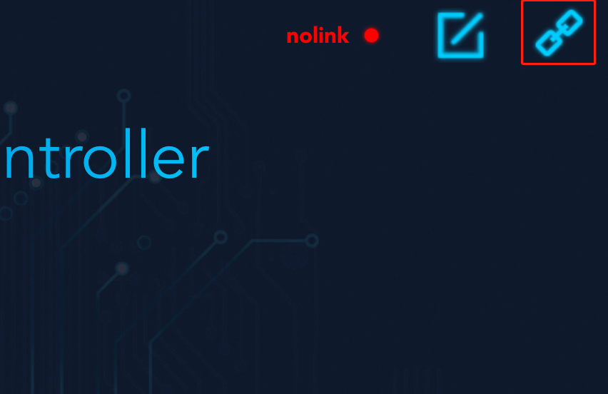

5. A prompt box will appear if the connection is successful.

.. image:: img/arduino_app_new2.png
  :width: 400
  :align: center

6. And the name of the car will be shown on APP.

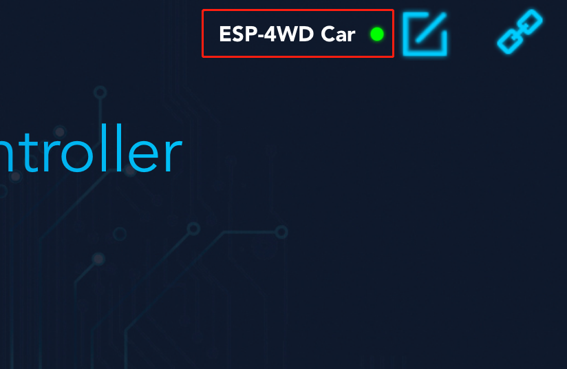

STA Mode
^^^^^^^^^

If you want to use STA mode, you need to connect Sunfounder Controller and ESP-4WD car to the same LAN.

1. Open the code ``ws.py``, modify the STA_NAME and STA_PASSWORD to yours.

  .. code-block:: python

    STA_NAME = "MakerStarsHall"
    STA_PASSWORD = "sunfounder"

2. Then define the ``SWITCH_MODE`` variable as ``sta``.

  .. code-block:: c
    
    SWITCH_MODE "sta"

3. After downloading the code, ESP-4WD car will automatically connect to the wifi network, and at the same time take out your mobile device, open the WLAN management interface 
and connect to this wifi network.

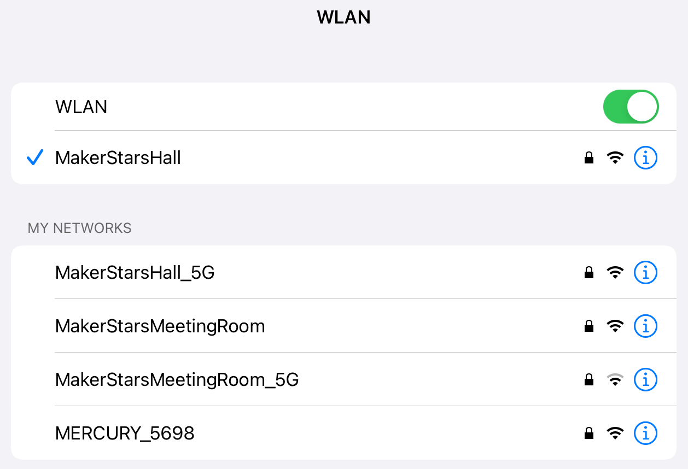

4. Open Sunfounder Controller and click the **Connect** icon on the top right corner.

5. Find the car name in the pop-up window and click on it.

.. image:: img/arduino_app_new4.png
  :width: 450
  :align: center

6. After connecting, the name of the car will be shown on APP.

.. _micropython_control_the_car_with_app:

Control the Car with APP
---------------------------

Either way, you can get the SunFounder Controller and ESP-4WD car to establish communication, next you will learn how to control the car with APP.

1. Open Sunfounder Controller, click the **+** to create an empty controller.

2. As shown in the figure, select the corresponding widget and click the icon in the upper right corner to save.

* **Widget A**: Show the driving speed of the car.
* **Widget D**: Simulate radar scanning.
* **Widget H**: Control the driving speed of the car.
* **Widget K**: Control the driving direction of the car.
* **Widget L**: Show the detection result of the grayscale sensor.
* **Widget M**: Control the on and off of the RGB board.
  
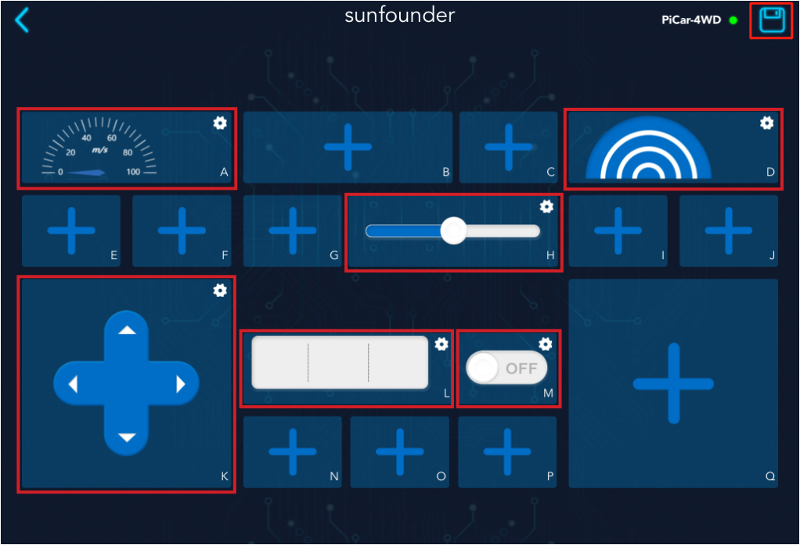

3. Click the start button in the upper right corner, and then try to use these widgets to control ESP-4WD car.

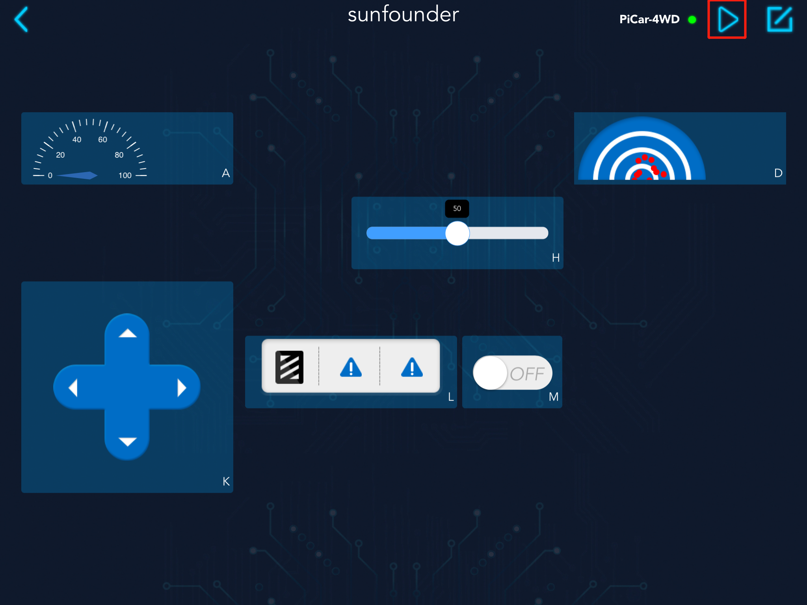

.. _micropython_diy_controller:

DIY Controller
-----------------------

If you want to DIY a new controller, you need to understand the communication process between the ESP-4WD car and the Sunfounder Controller. Open the 
``test_control.py`` file. You will go through this code to see how they communicate with each other.

Program framework
^^^^^^^^^^^^^^^^^^^

First, let us understand the general operating framework of the program.

Turn the code to line 34. In the ``main()`` function, we have written the basic
implementation code for build a controller.

* ``ws.start()``: Establish communication between ESP-4WD car and Sunfounder Controller.
* ``result = read()``: Read the received data and store it in the result variable.
* ``write()``：Send sensor data to Sunfounder Controller.

.. code-block:: python

    def main():
        ws.start()
        print("start")
        while True:
            result = read()
            if result != None:
                # coding the control function here.
                
                # coding the sensor function here.
                
                # ws.send_dict['L_region'] = car.get_grayscale_list() # example for test sensor date sending.
                write()
            time.sleep_ms(15)

Open the ``ws.py`` file, turn the code to line 87, in the ``start()`` function, we switch the
communication mode by judging the value of ``SWITCH_MODE`` .

.. code-block:: python

    def start(self):
        if SWITCH_MODE == "ap":
            self.wlan = network.WLAN(network.AP_IF)
            self.wlan.config(essid=AP_NAME, authmode=4, password=AP_PASSWORD)
            self.wlan.active(True)  # turning on the hotspot
        elif SWITCH_MODE == "sta":
            self.wlan = network.WLAN(network.STA_IF)
            self.wlan.active(True)
            self.wlan.connect(STA_NAME, STA_PASSWORD)

Receiving
^^^^^^^^^^^^^^^^^

The ESP-4WD car receives data from the Sunfounder Controller and sends its own sensor data to the Sunfounder Controller.
Let's find out what data ESP-4WD car receives from Sunfounder Controller.

**Step 1: Create new controller**

Run the ``test_control.py`` file, re-establish communication, and then open Sunfounder Controller to create 
a new controller. We add a slider in the H area and a D-Pad in the K area. After
adding, click the icon in the upper right corner to save.

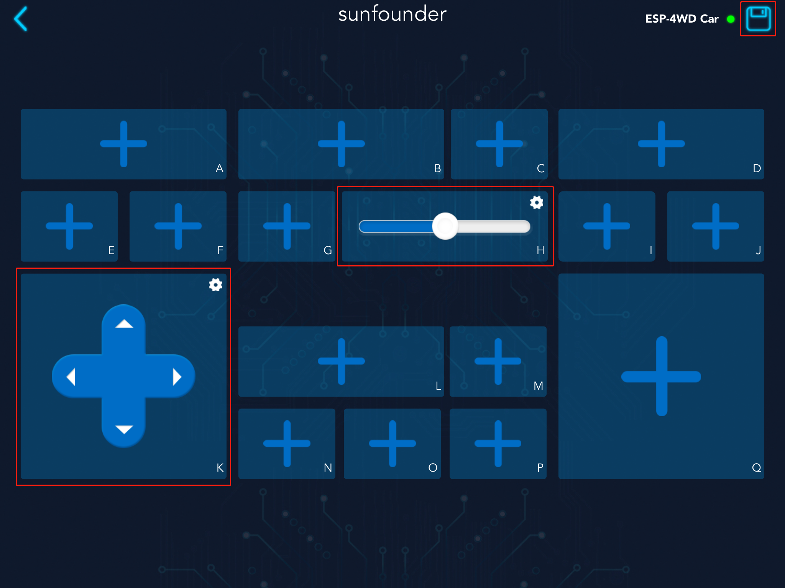

**Step 2: Receive data from SunFounder Controller**

Turn the code to line 14, in the ``read()`` function, we have realized the receiving and printing of the data sent by the Sunfounder Controller. 
The function of the variable ``temp`` is to prevent repeated printing of data.

.. code-block:: python

    def read():
        global temp
        recv = ws.read()
        if recv == None:
            return
        recv_data = json.loads(recv)
        if temp != recv_data:
            print("recv_data: %s\n"%recv_data)
            temp = recv_data        
        return recv_data

* Receive the Json object sent by Sunfounder Controller through the ``ws.read()`` function and store it in the ``recv`` variable.

  .. code-block:: python

      recv = ws.read()

* The variable ``recv`` (Json object format) is parsed into ``recv_data`` dictionary through the ``json.loads()`` function.

  .. code-block:: python

    recv_data = json.loads(recv)

* Print the value of variable ``recv_data``.

  .. code-block:: python

    print("recv_data: %s\n"%recv_data)

Click the start icon in the upper right corner to run the controller.

.. image:: img/arduino_app17.png
  :align: center

Open the Shell window under Thonny, we can find that the initial data of K
control is the string ``stop``, and the initial data of H widget is the int value 50.

.. image:: img/arduino_app18.png
  :width: 450
  :align: center

Press the arrow keys of the **D-Pad** in the K area and slide the **slider** in the H area.

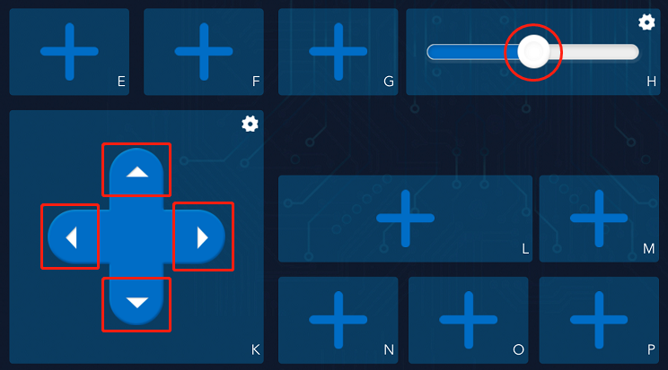

You can see that the **D-Pad** widget sends a string of data ("forward", "backward","left","right") to the ESP-4WD car, while the slider widget will send an int data (range: 0-100).

.. image:: img/arduino_app20.png
  :width: 450
  :align: center
    
**Step 3: Responding**

When ESP-4WD car receives data from Sunfounder Controller, it needs to respond accordingly.

Let’s write a piece of code that uses the widgets on the Sunfounder Controller to control the movement of the car. The K widget(D-Pad) controls the direction of the car, and the H widget(slider) controls the speed of the car.

Add the following highlighted code to line 41 (a blank line).

.. code-block:: python
  :emphasize-lines: 8

    def main():
    ws.start()
    print("start")
    while True:
        result = read()
        if result != None:
            # coding the control function here.
            car.move(result['K_region'], result['H_region'])
            # coding the sensor function here.
            
            # ws.send_dict['L_region'] = car.get_grayscale_list() # example for test sensor date sending.
            write()
        time.sleep_ms(15)

* Through the ``read()`` function, you can receive the data sent by Sunfounder Controller and store it in the result dictionary.

  .. code-block:: python

      result = read()

* Pass ``result['K_region']`` as the first parameter to the ``car.move()`` function to control the direction of the ESP-4WD car. Pass ``result['H_region']`` as the second parameter to the ``car.move()`` function to control the speed.
* The value of ``result['K_region']`` is the string data ("forward", "backward","left","right") sent by the K widget (D-Pad), the same as the value of ``result['H_region']`` is the int data sent by H widget (slide) (range: 0-100).

  .. code-block:: python

      car.move(result['K_region'], result['H_region'])

After save and run the modified code and re-establishing communication, open the controller and click the start icon in the upper right corner to run it.

The D-Pad in the K area can control the direction of the ESP-4WD car, and the slider in the H area can control the speed.

.. image:: img/arduino_app17.png
  :align: center

Sending
^^^^^^^^^

Let's take a closer look at how the ESP-4WD car sends its own sensor data to the Sunfounder Controller.

**Step 1: Create new controller**

Open the **test_control.py** file and go to line 44, delete the comment symbol for this code.

This code is used to get the grey scale sensor data from the ``car.get_grayscale_list()`` function and store it in the ``ws.send_dict`` dictionary and define the key as ``L_region``.

.. code-block:: python
  :emphasize-lines: 7
  
    def main():
    ws.start()
    print("start")
    while True:
        result = read()
        if result != None:
            # coding the control function here.
            
            # coding the sensor function here.
            
            ws.send_dict['L_region'] = car.get_grayscale_list() # example for test sensor date sending.
            write()
        time.sleep_ms(15)

            
Save and run this code, re-establish communication, and then open Sunfounder Controller to create a new controller. We add a grayscale detection tool in the L area. After adding, 
click the icon in the upper right corner to save.

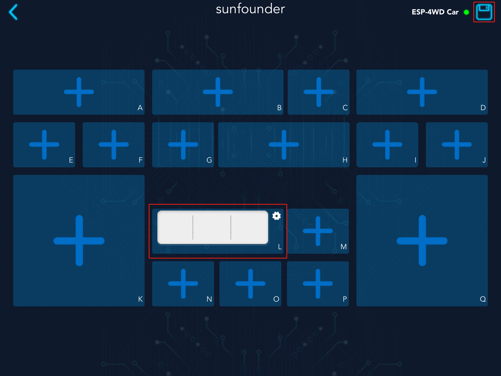
  
**Step 2: Receive data from SunFounder Controller**

Open the ``ws.py`` file and go to line 25. Here, the equipment information and proofreading 
information of ESP-4WD Car are stored in the ``send_dict`` dictionary.

.. code-block:: python

    send_dict = {
        'Name':AP_NAME,
        'Type':'ESP-4WD Car',
        'Check':'SunFounder Controller',
        }

Open the ``test_control.py`` and go to line 26, through the ``write()`` function, we send sensor data to the Sunfounder Controller, 
where the variable ``temp_send`` is used to prevent repeated printing of data.

.. code-block:: python
    :emphasize-lines: 3,5

    def write():
        global temp_send
        ws.write(json.dumps(ws.send_dict))
        if temp_send != ws.send_dict:
            print("send_data:%s\n"%ws.send_dict)
            temp_send = ws.send_dict.copy
        return

* First, use the ``json.dumps()`` function to convert the ``ws.send_dict`` dictionary into a Json object, and then use the ``ws.write()`` function to send the Json object storing the sensor data to the Sunfounder Controller.

  .. code-block:: python

      ws.write(json.dumps(ws.send_dict))

* Then print the value of the ``ws.send_dict dictionary``.

  .. code-block:: python

      print("send_data:%s\n"%ws.send_dict)

Click the start icon in the upper right corner to run the controller.

.. image:: img/arduino_app17.png
  :align: center

Open the Shell window under Thonny, you will see that the ESP-4WD car has been sending device information, calibration information and the value of the grayscale sensor to the Sunfounder Controller.

.. image:: img/arduino_app22.png
  :width: 450
  :align: center

**Step 3: Responding**

Let's write a piece of code that show the sensor data of Sunfounder Controller. Widget L (grayscale detection tool) will show you the grayscale of the ground.

Turn the code to line 34, Let's re-explain the content of the ``main()`` event. 

.. code-block:: python
  :emphasize-lines: 6,7

  def main():
      ws.start()
      print("start")
      while True:
          result = read()
          if result != None:               
              ws.send_dict['L_region'] = car.get_grayscale_list()
              write()
          time.sleep_ms(15)

* By ``car.get_grayscale_list()`` function, we can get the list of grayscale sensor detection values and assign them to ``ws.send_dict['L_region']``.

  .. code-block:: python

      ws.send_dict['L_region'] = car.get_grayscale_list()

* Send sensor data, device information and proofreading information of the ESP-4WD car to Sunfounder Controller through ``write()`` function.

  .. code-block:: python

      write()

Now, open the SunFounder Controller again, Widget D (grayscale detection tool) is showing the current ground conditions.

.. image:: img/arduino_app23.png
  :align: center

