APP control
============

In this chapter,你将学习使用Sunfounder Controller这款遥控器软件，并在Sunfounder Controller上diy一个遥控器来
控制小车。

.. toctree::
  :maxdepth: 2

  Install Sunfounder Controller
  About Sunfounder Controller
  Establish communication
  APP操作
  DIY遥控器

Install Sunfounder Controller
-------------------------------

Open App Store (iOS/Mac OS X system) or Play Store (Android/Windows/Linux
system), then search and download Sunfounder Controller.

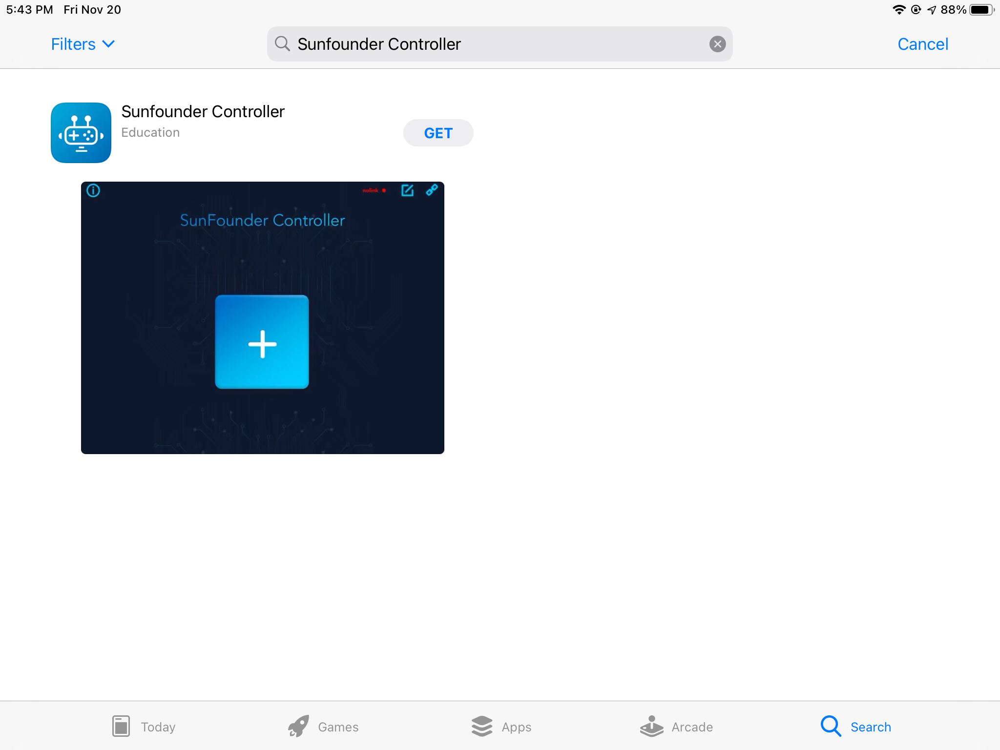

About Sunfounder Controller
-----------------------------

Page Introduction
^^^^^^^^^^^^^^^^^^

Start the Sunfounder Controller.

.. image:: img/arduino_app2.png
  :width: 150
  :align: center

Click the middle button to add a new controller.

.. image:: img/arduino_app3.png
  :width: 450
  :align: center

Sunfounder Controller is a platform that can add custom remote control handles. It
reserves many control interfaces. There are a total of 17 areas from A to Q. Each area
has selectable widgets.

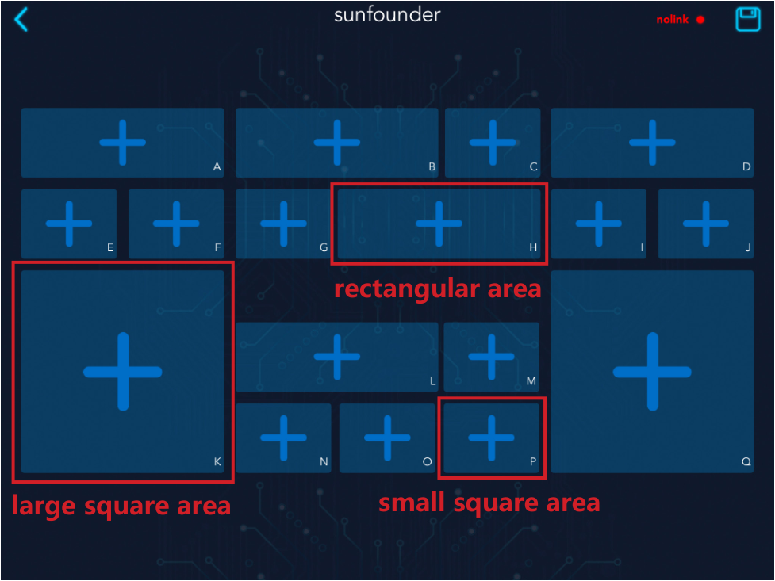

The available widgets in the large square area include joystick and cross-shaped
steering wheel.

.. image:: img/arduino_app5.png
  :width: 400
  :align: center

The available widgets in the small square area include buttons, digital displays and
switches.

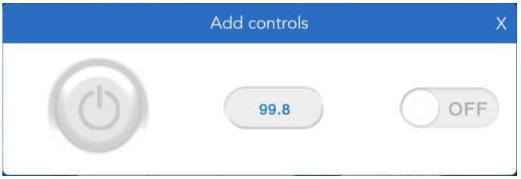

The available widgets for the rectangular area include slider, dial, ultrasonic radar and
grayscale detection tool.

.. image:: img/arduino_app7.png
  :width: 510
  :align: center

Widget List
^^^^^^^^^^^^

For the convenience of writing code, this chapter will introduce the use of various
widgets on Sunfounder Controller, the parameter types and ranges of control widgets,
and the parameter types and ranges of display widgets.

The control widgets of Sunfounder Controller include buttons, switches, joystick,
cross-shaped steering wheel, and slider.

You can modify the widget name and the parameter range of some widgets by clicking 
the icon in the upper right corner of the widget.

.. image:: img/arduino_app8.png
  :width: 550
  :align: center

When we use these control widgets, ESP-4WD RDP will receive the control data.
Through these control data, we can write code to control the car.

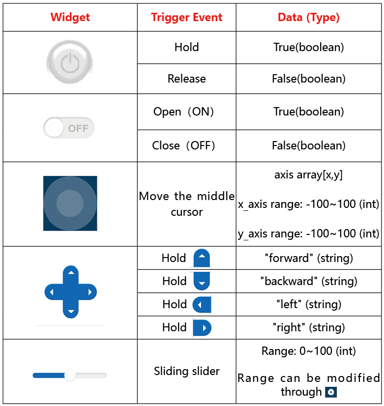

The display widget of Sunfounder Controller includes digital displays, dial, ultrasonic
radar, and grayscale detection tool.

When we send sensor data to these display widgets, we can display the data on the
corresponding widgets. At the same time, you can also modify the name, unit and
parameter range of the display widget by clicking the icon in the upper right
corner.

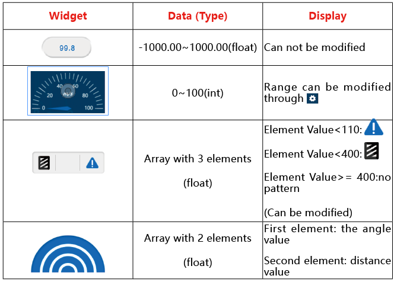

Establish communication
------------------------

In addition to the code control method, we also provide the APP control method.
You can open Sunfounder Controller on mobile phones, tablets and other devices,
and then make a controller to control ESP-4WD Car.

运行代码
^^^^^^^^^

Open the ws.py file in the MicroPython device.

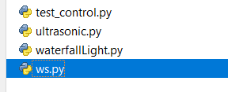

AP mode
^^^^^^^^

There are two ways to establish communication between Sunfounder Controller
and ESP32 RDP: One is AP mode, the other is STA mode. We can switch the 
communication mode by modifying the code of ws.py.

If you want to use AP mode, you need to connect Sunfounder Contorller to the hotspot released by ESP32 RDP. 
Move the code to line 10, please set SSID and PSK here.（代码中的NAME既是SSID，同时也是小车的名字） If you have more than one EPS-4WD Cars, you need to 
set different NAMEs for them to avoid a wrong connection. In addition, you need to set a password of more
than 8 digits.

.. code-block:: python

    NAME = 'ESP-4WD Car'
    AP_PASSWORD = "123456789"

Then modify the content of line 10 and define the SWITCH_MODE variable as "ap".

.. code-block:: python

    SWITCH_MODE = "ap"

After downloading the code, ESP32 RDP will send a hotspot signal, then take out your
electronic device, open the WLAN management interface and connect to the wifi
network.

.. image:: img/arduino_app12.png
  :width: 400
  :align: center

打开Sunfounder Controller，点击右上方的连接图标。

.. image:: img/arduino_app_new1.png
  :width: 300
  :align: center

连接成功会出现提示框。

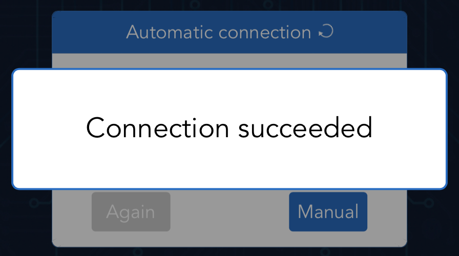

并且在sunfounder的界面上会显示小车的名字。

.. image:: img/arduino_app_new3.png
  :width: 300
  :align: center

STA mode
^^^^^^^^^

If you want to use AP mode, you need to connect Sunfounder Controller and ESP32 RDP to the same LAN.
Turn the code to line 12, there are two macros that define the wifi information. ESP32
RDP will search for and connect to this wifi, and at the same time your electronic
device should connect to this wifi.

.. code-block:: python

    STA_NAME = "MakerStarsHall"
    STA_PASSWORD = "sunfounder"

Then modify the content of line 14 and define the SWITCH_MODE variable as "sta".

.. code-block:: python

    SWITCH_MODE = "sta"

After downloading the code, ESP32 RDP will automatically connect to the wifi network
, and at the same time take out your electronic device, open the WLAN management interface 
and connect to this wifi network.

.. image:: img/arduino_app13.png
  :width: 400
  :align: center

打开Sunfounder Controller，点击右上方的连接图标。

.. image:: img/arduino_app_new1.png
  :width: 300
  :align: center

在弹出的确认框中找到小车名字，点击它。

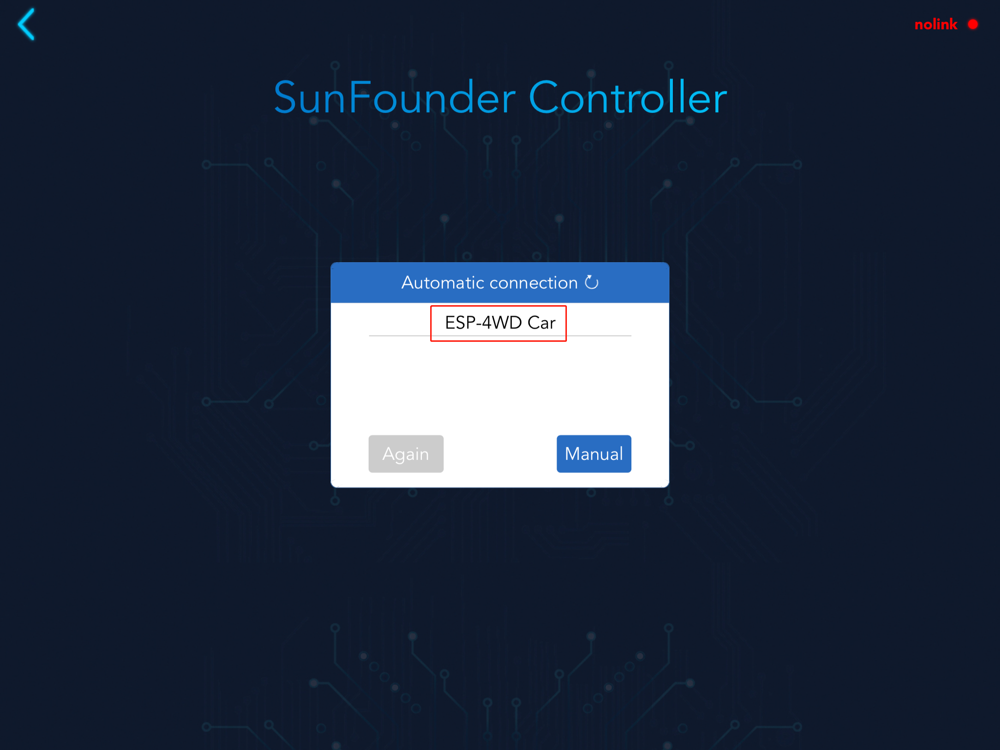

连接成功后，在sunfounder的界面上会显示小车的名字。

.. image:: img/arduino_app_new3.png
  :width: 300
  :align: center

APP操作
--------

Download this code, and then using any of the above methods to establish
communication.

添加按键
^^^^^^^^^

Open Sunfounder Controller, and then 新建 an empty controller.

.. image:: img/arduino_app3.png
  :width: 450
  :align: center

As shown in the figure, select the corresponding widget for the controller. After
adding, click the icon in the upper right corner to save the configuration.

.. image:: img/arduino_app14.png
  :width: 450
  :align: center

Click the start button in the upper right corner, and then try to use this controller to
control ESP-4WD Car.

Widget A is used to display the driving speed of the car.

Widget D is used to simulate radar scanning.

Widget H is used to control the driving speed of the car.

Widget K is used to control the driving direction of the car.

Widget L is used to display the detection result of the grayscale sensor.

Widget M is used to control the on and off of the RGB board.

.. image:: img/arduino_app15.png
  :width: 450
  :align: center

DIY遥控器
----------

如果你想要DIY一个新的遥控器，你需要了解ESP32 RDP和Sunfounder Controller之间的通信过程。Open the 
test_control.py file. 你将通过这个代码来了解它们之间的通信。

Program framework
^^^^^^^^^^^^^^^^^^^

First, let us understand the general operating framework of the program.

Turn the code to line 34. In the main() function, we have written the basic
implementation code for build a controller.

ws.start(): Establish communication between ESP-4WD RDP and Sunfounder
Controller.

result = read(): Read the received data and store it in the result variable.

write()：Send sensor data to Sunfounder Controller.

.. code-block:: python

    def main():
        ws.start()
        print("start")
        while True:
            result = read()
            if result != None:
                # coding the control function here.
                
                # coding the sensor function here.
                
                # ws.send_dict['L_region'] = car.get_grayscale_list() # example for test sensor date sending.
                write()
            time.sleep_ms(15)

Open the ws.py file, turn the code to line 87, in the start() function, we switch the
communication mode by judging the value of SWITCH_MODE.

.. code-block:: python

    def start(self):
        # self.stop()
        if SWITCH_MODE == "ap":
            self.wlan = network.WLAN(network.AP_IF)
            self.wlan.config(essid=AP_NAME, authmode=4, password=AP_PASSWORD)
            self.wlan.active(True)  # turning on the hotspot
        elif SWITCH_MODE == "sta":
            self.wlan = network.WLAN(network.STA_IF)
            self.wlan.active(True)
            self.wlan.connect(STA_NAME, STA_PASSWORD)

接收过程
^^^^^^^^^

在ESP32 RDP会与Sunfounder Controller的通信过程会产生数据交互，ESP32 RDP既会接收来自Sunfounder Controller的数据，
也会将自身的传感器数据发送给Sunfounder Controller。所以我们先来了解一下ESP32 RDP从Sunfounder Controller接收了
哪些数据。

**Step 1:创建遥控器**

Run the test_control.py file, re-establish communication, and then open Sunfounder Controller to create 
a new controller. We add a slider in the H area and a cross-shaped steering wheel in the K area. After
adding, click the icon in the upper right corner to save.

.. image:: img/arduino_app16.png
  :width: 450
  :align: center

**Step 2:小车接收控件的值**

Turn the code to line 14, in the read() function, we realized the receiving and printing
of the data sent by the Sunfounder Controller. The function of the temp variable is to
prevent repeated printing of data.

.. code-block:: python

    def read():
        global temp
        recv = ws.read()
        if recv == None:
            return
        recv_data = json.loads(recv)
        if temp != recv_data:
            print("recv_data: %s\n"%recv_data)
            temp = recv_data        
        return recv_data

Receive the Json object sent by Sunfounder Controller through the ws.read()
function and store it in the recv variable.

.. code-block:: python

    recv = ws.read()

Parse recv variable (Json object format) into recv_data dictionary through the
json.loads( ) function.

.. code-block:: python

    recv_data = json.loads(recv)

Print recv_data variable.

.. code-block:: python

    print("recv_data: %s\n"%recv_data)

Click the start icon in the upper right corner to run the controller.

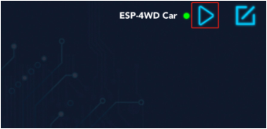

Open the Shell window under Thonny, we can find that the initial data of K
control is the string "stop", and the initial data of H widget is the int value 50.

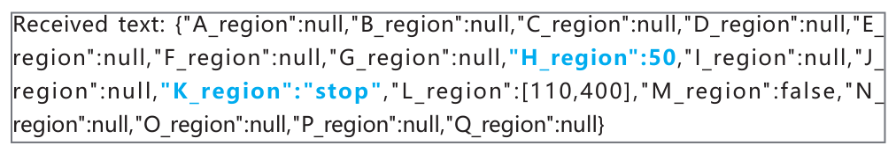

按住K区域的cross-shaped steering wheel的不同方向键，并且滑动H区域的slider。

.. image:: img/arduino_app19.png
  :width: 450
  :align: center

You can see that the cross-shaped steering
wheel widget sends a string of data ("forward", "backward", "left", "right") to the ESP-
4WD RDP. The slider widget will send an int data (range: 0-100) to the ESP-4WD RDP.

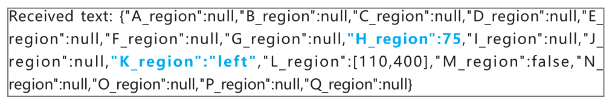
    
**Step 3:小车响应**

当ESP-4WD Car接收到来自Sunfounder Controller不同控件的数据时，它需要做出相应的响应。
Let’s write a piece of code that uses the widgets on the Sunfounder Controller 
to control the movement of the car. The K widget(cross-shaped steering wheel) controls
the direction of the car, and the H widget(slider) controls the speed of the car.

Turn the code to line 43，我们将以下代码添加在这一行里。（有部分被注释的内容未展示，请不要将它们删除。）

.. code-block:: python

    def main():
        ws.start()
        print("start")
        while True:
            result = read()
            if result != None:
                car.move(result['K_region'], result['H_region'                
                # ws.send_dict['L_region'] = car.get_grayscale_list() # example for test sensor date sending.
                write()
            time.sleep_ms(15)

Through the read() function, you can receive the data sent by Sunfounder
Controller and store it in the result dictionary.

.. code-block:: python

    result = read()

The value of doc_recv["K_region"] is the string data ("forward", "backward","left",
"right") sent by the K widget (cross-shaped steering wheel), the same as the value of
doc_recv["H_region"] is the int data sent by H widget (slide) (range: 0-100).

Pass doc_recv["K_region"] as the first parameter to the car.move() function to control
the direction of the ESP-4WD Car. Pass doc_recv["H_region"] as the second parameter
to the car.move() function to control the speed of ESP-4WD Car.

.. code-block:: python

    car.move(result['K_region'], result['H_region'])

After downloading the modified code and re-establishing communication, open the
controller and click the start icon in the upper right corner to run the controller.
The cross-shaped steering wheel in the K area can control the direction of the ESP-
4WD Car, and the slider in the H area can control the speed of the ESP-4WD Car.

发送过程
^^^^^^^^^

我们再来了解一下ESP32 RDP是如何将自身的传感器数据发送给Sunfounder Controller。

**Step 1:创建遥控器**

Open the **ws.py** file and turn the code to line 25. Here, the equipment information and proofreading 
information of ESP-4WD Car are stored in the send_dict dictionary.（有部分被注释的内容未展示，请不要将它们删除。）

.. code-block:: python

    send_dict = {
        'Name':AP_NAME,
        'Type':'ESP-4WD Car',
        'Check':'SunFounder Controller',
        }

Open the **test_control.py** file and turn the code to line 44, delete the comment symbol for this code. 
Obtain the grayscale sensor data through the car.get_grayscale_list() function and store it in the
ws.send_dict dictionary with the key'L_region'.

.. code-block:: c
    :emphasize-lines:7

    def main():
        ws.start()
        print("start")
        while True:
            result = read()
            if result != None:                
                ws.send_dict['L_region'] = car.get_grayscale_list()
                write()
            time.sleep_ms(15)

Turn the code to line 44, through the write() function, we send sensor data to the Sunfounder Controller, 
where the temp_send variable is used to prevent repeated printing of data.

.. code-block:: python
    :emphasize-lines:3,5

    def write():
        global temp_send
        ws.write(json.dumps(ws.send_dict))
        if temp_send != ws.send_dict:
            print("send_data:%s\n"%ws.send_dict)
            temp_send = ws.send_dict.copy
        return

我们来解释一下这段代码。First, use the json.dumps() function to convert the ws.send_dict dictionary into
a Json object, and then use the ws.write() function to send the Json object storing the
sensor data to the Sunfounder Controller.

.. code-block:: python

    ws.write(json.dumps(ws.send_dict))

然后Print the value of the ws.send_dict dictionary.

.. code-block:: python

    print("send_data:%s\n"%ws.send_dict)

Download this code again, and turn on the controller after establishing communication.

Open the Shell window under Thonny, you will see that the ESP-4WD RDP has been 
sending device information, calibration information and the value of the grayscale 
sensor to the Sunfounder Controller.

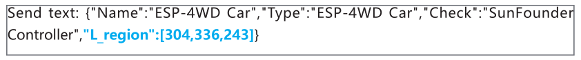

**Step 3:小车响应**

Let's write a piece of code that display the sensor data of ESP-4WD RDP on the
widget of Sunfounder Controller.Widget D (grayscale detection tool)将会根据检测到的灰度值显示地面情况。

Turn the code to line 34, 我们来重新解释一下main()函数的内容。

.. code-block:: python
    :emphasize-lines:6,7

    def main():
        ws.start()
        print("start")
        while True:
            result = read()
            if result != None:               
                ws.send_dict['L_region'] = car.get_grayscale_list()
                write()
            time.sleep_ms(15)

通过car.get_grayscale_list()函数，我们可以获取储存着灰度传感器检测值的列表， 
并将列表里的内容赋值给doc_send["L_region"]。

.. code-block:: python

    ws.send_dict['L_region'] = car.get_grayscale_list()

Send sensor data, device information and proofreading information of the ESP-4WD RDP 
to Sunfounder Controller through write() function.

.. code-block:: python

    write()

回到遥控器界面，Widget D(grayscale detection tool)正在显示当前地面情况，如果想要知道更多关于控件的信息，请回到
Widget List查看。

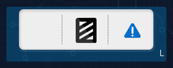

