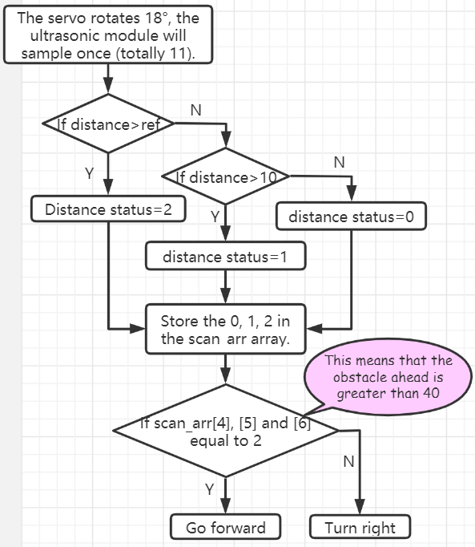
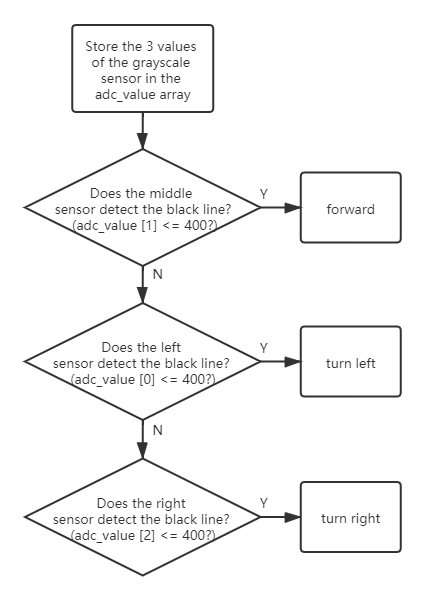

Code Control
=============

In this chapter you will learn to control the ESP-4WD car with Arduino codes.

You can copy the code below into the Arduino IDE or directly open the code fileunder the path ``esp-4wd\Micropython\esp_rdp\examples``.

1-4 and servo code files have been used in the chapter :ref:`Test the Components with Arduino`, just for simple testing of motor, ultrasonic module, Grayscale Sensor Module, 8-bit RGB board and Servo.

Here, we focus on the three codes of 5-7. 

In addition, the 8 and 9 code files are used in the :ref:`app_control_arduino` chapter, and will not be explained here.

waterfallLight
----------------

After running ``5.waterfallLight.ino``, the LEDs on the 8-bit RGB board under the car will turn on in random colors from the first to the 24th , and then turn off one by one from both ends to the middle.

After that, the RGB lights will turn on in random colors from the 24th to the first, and then turn off one by one from both ends to the middle.

.. code-block:: c

    #include "ESP32_RDP.h"

    ESP32car car;

    void setup() {
    }

    void loop() {
        int red = random(255);
        int green = random(255);
        int blue = random(255);
        for (int i = 0; i < 24; i++)
        {
            car.set_num_light(i, red, green, blue);
            delay(20);
        }
        for (int i = 23; i > 11; i--)
        {
            int j = 23 - i;
            car.set_num_light(i, 0, 0, 0);
            car.set_num_light(j, 0, 0, 0);
            delay(40);
        }
        for (int i = 23; i >= 0; i--)
        {
            car.set_num_light(i, red, green, blue);
            delay(20);
        }
        for (int i = 23; i > 11; i--)
        {
            int j = 23 - i;
            car.set_num_light(i, 0, 0, 0);
            car.set_num_light(j, 0, 0, 0);
            delay(40);
        }
    }

The statement to light up the LED is ``car.set_num_light(i, red, green, blue)``; the first
parameter is the number of the light, and the last three parameters are the RGB value.

For example, ``car.set_num_light(4,255,0,0)`` means to make the No. 4 LED light up in
red.

measureSpeed
-------------

Run ``6.measureSpeed.ino``, the car will move at a random speed, and the 2-ch Photo-
interrupter module will detect the speed of the car.

The light emitted from the transmitting end of the 2-ch Photo-interrupter module
to the receiving end will pass through the Encoding Disk (with 20 holes). When
the receiving end does not receive the light, it will send a ``0`` to the microcontroller,
otherwise it will send a ``1``.

This means that when a total of 20 ``1`` are detected, the wheel of the car has turned one
round (a distance of the wheel circumference has been traveled forward).

In the same way, we can detect the frequency of the ``1`` received by the
microcontroller and calculate the speed of the car in cm/s.

.. code-block:: c

    #include "ESP32_RDP.h"

    ESP32car car;

    #define SPEED_PIN_LEFT    26
    #define SPEED_PIN_RIGHT    25

    hw_timer_t * timer = NULL;
    volatile uint8_t left_Counter = 0;
    volatile uint8_t right_Counter = 0;
    int counter = 0;
    float carSpeed = 0;

    void on_left_Pin() {
        left_Counter++;
    }

    void on_right_Pin() {
        right_Counter++;
    }

    void IRAM_ATTR onTimer() {
        counter = (left_Counter + right_Counter);
        left_Counter = 0;
        right_Counter = 0;
    }

    float get_speed() {
        float value = 0;
        value = float(counter) / 2.0 / 20.0 * 2.0 * 3.14 * 3.3;
        return value;
    }

    void setup() {
        Serial.begin(115200);
        pinMode(SPEED_PIN_LEFT, INPUT);
        attachInterrupt(SPEED_PIN_LEFT, on_left_Pin, RISING);
        pinMode(SPEED_PIN_RIGHT, INPUT);
        attachInterrupt(SPEED_PIN_RIGHT, on_right_Pin, RISING);
        // Set 80 divider for prescaler (see ESP32 Technical Reference Manual for more
        // info).
        timer = timerBegin(2, 80, true);
        // Attach onTimer function to our timer.
        timerAttachInterrupt(timer, &onTimer, true);
        // Set alarm to call onTimer function every second (value in microseconds).
        // Repeat the alarm (third parameter)
        timerAlarmWrite(timer, 1000000, true);
        // Start an alarm
        timerAlarmEnable(timer);
    }

    void loop() {
        int speed = random(100);
        car.move("forward", speed);
        carSpeed = get_speed();
        Serial.println(carSpeed);
        delay(1000);
    }

morePlay
---------

Run ``7.morePlay.ino``, this example provides 4 ways to play ESP-4WD car. You can switch
between different modes by modifying the value of the **mode** variable.

.. code-block:: c

    #include "ESP32_RDP.h"

    ESP32car car;

    int mode = 1;

    void setup() {
    }

    void loop() {
        switch (mode)
        {
            case 1:
            car.avoid(40, 30);
            break;
            case 2:
            car.follow(40, 30);
            break;
            case 3:
            car.is_on_edge(110);
            break;
            case 4:
            car.track_line(400 , 50);
            break;
        }
    }

Function Introduction of morePlay
^^^^^^^^^^^^^^^^^^^^^^^^^^^^^^^^^^
.. note::

    For how the following 4 functions implement the corresponding functions, please refer to ``ESP32_RDP.cpp`` and ``ESP32_RDP.h`` under the path ``esp-4wd\Arduino\esp_rdp\src``.

**avoid()**

The default mode(mode=1) is obstacle avoidance. 

``avoid(int ref, int speed)``

* ``ref`` refers to the reference distance value.
* ``speed`` refers to the forward speed.

ESP-4WD car will move forward at 30% speed and return the distance state according to the obstacle in front. 

* If distance > 40, return the distance state 2, if distance > 10, then return 1, otherwise it will return 0. 
* If the obstacle distance is greater than 40, the car will move forward, otherwise it will turn right.

**follow()**

Modify the value of the mode variable to 2 so that the mode is set to follow.

``follow(int ref, int speed)``

* ``ref`` refers to the reference distance value.
* ``speed`` refers to the forward speed.

ESP-4WD car will move forward at 30% speed and automatically follow objects within 40cm in front.

**is_on_edge()**

Modify the value of the mode variable to 3 so that the mode is set to cliff detection. 

``is_on_edge(int ref)``

* ``ref`` refers to the reference gray value.

When ESP-4WD car detects a cliff (a place where the grayscale sensor's detection value is below 110), it will retreat a certain distance.

.. image:: img/arduino_code5.png
    :width: 500
    :align: center

**track_line()**

Modify the value of the mode variable to 4 so that the mode is set to track line.

``track_line(int ref, int speed)``

* ``ref`` refers to the reference gray value.
* ``speed`` refers to the forward speed.

.. note::
    You can replace ``ref``(400) with another number, which is the threshold between the black line and the white ground read by the grey scale sensor.

The ESP-4WD car moves along the black line on the white ground.

