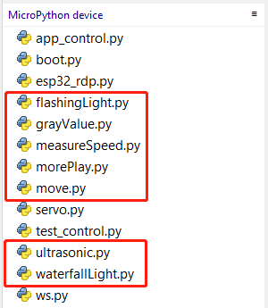
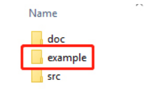
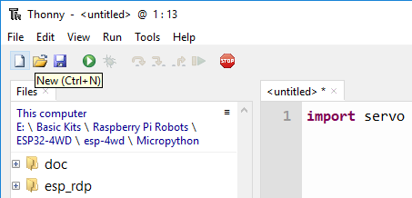
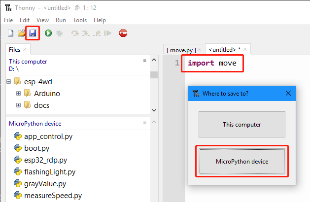
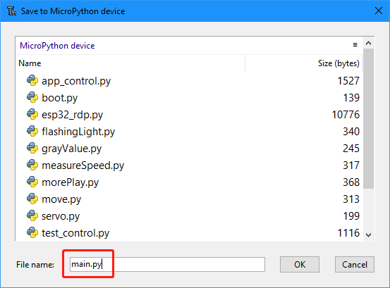

Code Control
=============

In this chapter, we are provided with method of arduino control. Open esp-4wd\
Micropython\example, you can see a total of 7 code examples, you can use these 7
examples to quickly get started using the ESP-4WD Car.

.. toctree::
    :maxdepth: 1

    move
    ultrasonic
    grayValue
    flashingLight
    waterfallLight
    measureSpeed
    morePlay
    开机自启的方法

move
-----

Run the move.ino file, the car will go
forward 1s, go backward 1s, turn left 1s, turn right 1s at 30% speed, and finally stop.

.. code-block:: python

    import esp32_rdp as car
    import time

    def main():
        car.move("forward", 30)
        time.sleep(1)
        car.move("backward", 30)
        time.sleep(1)
        car.move("left", 30)
        time.sleep(1)
        car.move("right", 30)
        time.sleep(1)
        car.move("stop")

    try:
        main()
    finally:
        car.move("stop") 

ultrasonic
-----------

Run ultrasonic.py, the Shell window will always print the distance value read by the ultrasonic module.

.. code-block:: python

    import esp32_rdp as car
    import time

    ult = car.Ultrasonic(13,12)

    def main():
        while True:
            distance = ult.get_distance()
            print('distance:%0.2f' % distance)
            time.sleep(0.1)

    main()

grayValue
-----------

Run grayValue.py, the Shell window will always print the reading value of the grayscale sensor.

.. code-block:: python

    import esp32_rdp as car
    import time

    grayValue = []

    def main():
        while True:
            grayValue = car.get_grayscale_list()
            print('grayValue: %d %d %d' %(grayValue[0],grayValue[1],grayValue[2]))
            time.sleep(1)

    main()

flashingLight
---------------

Run flashingLight.py, the RGB light under the car flashes every 0.5 seconds and
changes color every time it flashes.

.. code-block:: python

    import esp32_rdp as car
    import random
    import time

    def main():
        while True:
            color = [random.randint(0,255),random.randint(0,255),random.randint(0,255)]
            car.set_light_color(color)
            time.sleep(0.5)
            car.set_light_off()
            time.sleep(0.5)

    try:
        main()
    finally:
        car.set_light_off()

waterfallLight
----------------

Run waterfallLight.py, the RGB lights under the car will gradually turn on from the
first to the twenty-fourth, and then turn off from the end to the middle. After that,
the RGB lights will turn on from the twenty-fourth to the first, and then turn off from
the end to the middle.

.. code-block:: python

    import esp32_rdp as car
    import random
    import time

    def main():
        while True:
            color = [random.randint(0,255),random.randint(0,255),random.randint(0,255)]
            noColor = []
            for i in range(24):
                car.set_num_color(i,color)
                time.sleep_ms(20)
            for i in range(23,11,-1):
                j = 23-i
                car.set_num_color(i, noColor)
                car.set_num_color(j, noColor)
                time.sleep_ms(40)
            for i in range(23,0,-1):
                car.set_num_color(i,color)
                time.sleep_ms(20)
            for i in range(23,11,-1):
                j = 23-i
                car.set_num_color(i,noColor)
                car.set_num_color(j,noColor)
                time.sleep_ms(40)

    try:
        main()
    finally:
        car.set_light_off()

The sentence to light up the LED is car.set_num_color(i, red, green, blue); the first
parameter is the number of the light, and the last three parameters are the RGB value.
For example, car.set_num_color(4,255,0,0) means to make the No. 4 LED light up in
red.

measureSpeed
--------------

Run measureSpeed.py, 小车将会以随机速度前进一秒，并把Photo-interrupter Module检测到的速度打印在Shell窗口。

.. code-block:: python

    import esp32_rdp as car
    import random
    import time

    speed = car.Speed(26, 25)

    def main():
        while True:
            car.move("forward",random.randint(0,100))
            time.sleep(1)
            carSpeed = speed.get_speed()
            print('distance:%d' % carSpeed)

    try:
        main()
    finally:
        car.move("stop")

morePlay
---------

Run 7.morePlay.py, this example provides 4 ways to use ESP-4WD Car. You can switch
between different modes by modifying the value of the mode variable.

.. code-block:: python

    import esp32_rdp as car

    mode = 1

    def main():
        while True:
            global mode
            if mode == 1:
                car.avoid(40,30)
            elif mode == 2:
                car.follow(40,30)
            elif mode == 3:
                car.is_on_edge(110)
            elif mode == 4:
                car.track_line(400,50)

    try:
        main()
    finally:
        car.move("stop")

**avoid**

Modify the value of the mode variable to 1. ESP-4WD Car will advance at 30% speed
and turn right to avoid obstacles ahead。

**follow**

Modify the value of the mode variable to 2. ESP-4WD Car will move forward at 30%
speed and automatically follow objects within 40cm in front.

**cliff detection**

Modify the value of the mode variable to 3. When ESP-4WD Car detects a cliff (a place
where the grayscale sensor's detection value is below 110), it will retreat a certain
distance.

**track_line**

Modify the value of the mode variable to 4. The ESP-4WD Car moves along the black
line on the white ground (where the grayscale sensor detection value is below 400).

开机自启
--------

由于前面提供的7个示例在断电重启后，不会再重新运行。所以在这里，我们提供让python程序开机自启动的方法。

点击左上角的新建文件图标

在新建的文件中输入

.. code-block:: python

    import move

点击左上角的保存按钮，在弹出的选项框中选择**MicroPython device**。

将文件命名为main.py（如果你用了其他命名，将导致无法开机自启）

运行main.py，小车将会执行move.py文件里的代码。并且在下次重启小车后，代码仍然有效。
如果你想要运行其他示例代码，只需要修改main.py的内容，例如你想要每次上电是运行waterfallLight.py的代码，则输入

.. code-block:: python

    import waterfallLight

