Component Testing by Arduino
================================

Before assembling the ESP-4WD Car, you need to test each device to make sure they are working properly, if there is any problem with the device, please contact us.

Power to ESP32 RDP
---------------------------

Connect ESP32 RDP to PC.

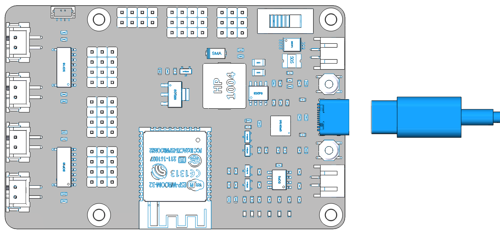

Powering ESP32 RDP with batteries.

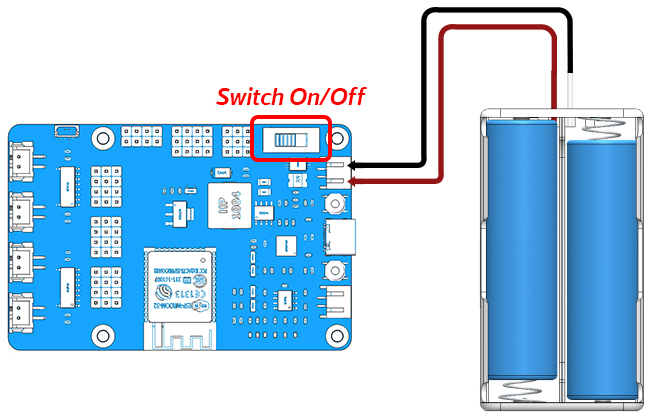

Test the motor
-----------------

Finishing the wire up according to the diagram.

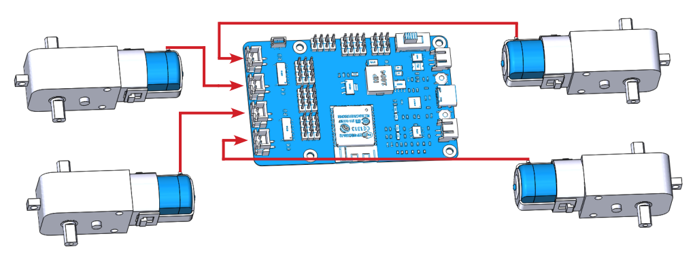

Open the ``1.move.ino`` file in the ``esp-4wd\Arduino\example\1.move`` path.
(You should have downloaded these files at `github <https://github.com/sunfounder/esp-4wd>`_ before.)

Select the Board and Port.
**(Board:ESP32 Arduino -> NodeMCU-32S)**

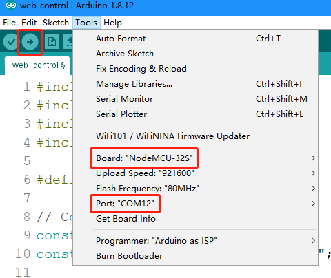

Compile and upload.

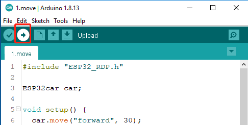

After running the code, you will see the four motors turning and changing the direction of rotation back and forth, and finally stopping.

Test the ultrasonic module
---------------------------

Finishing the wire up according to the diagram.

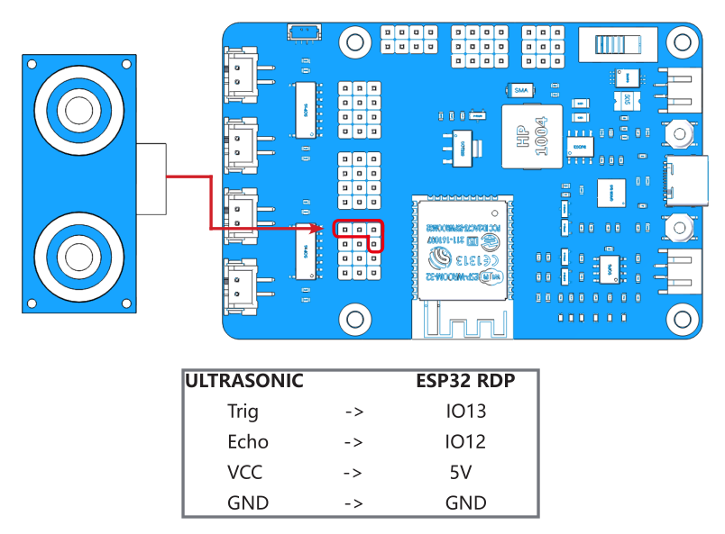

Run the ``2.ultrasonic.ino`` file in the ``esp-4wd\Arduino\example\2.ultrasonic`` path. Click the icon in the upper 
right corner to open the serial debugging assistant, Set the baud rate to 115200.

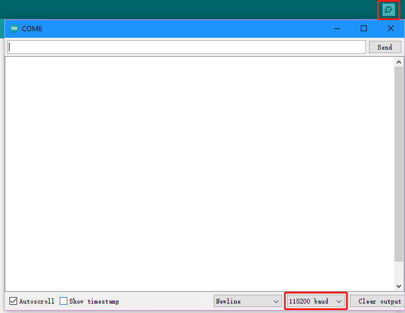

The serial port of arduino will always print the distance value read by the ultrasonic module.

Test the grayscale sensor module
---------------------------------

Finishing the wire up according to the diagram.

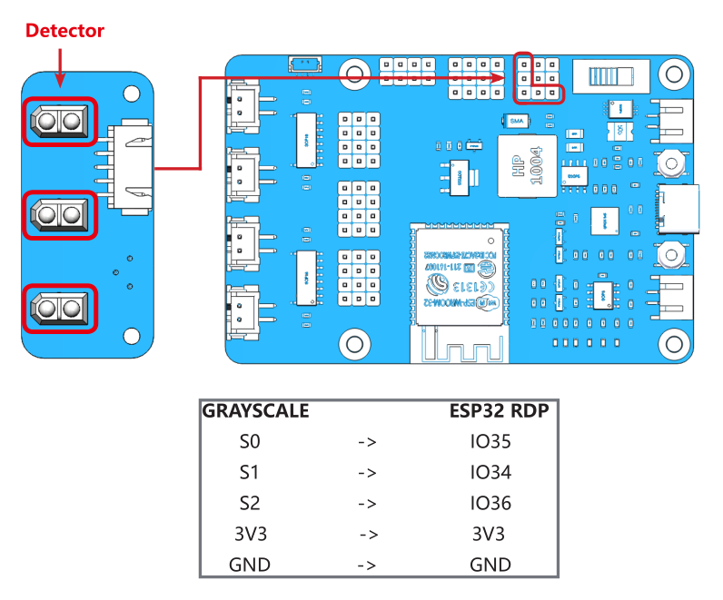

Run the ``3.grayValue.ino`` file in the ``esp-4wd\Arduino\example\3.grayValue`` path, the serial port of arduino will always print the reading value of the
grayscale sensor.

When using the Grayscale sensor module, the probe should be about 5 mm from the ground.

Normally, it will detect a value above 1100 on white ground. 
On black ground, it will detect values below 900. 
On a cliff, it will detect a value below 110. (If the reading is 0, it means that the probe does not detect the ground.)

If the grayscale sensor module does not detect normal values, you will need to calibrate it.

Hover it over a white ground and twist the potentiometer clockwise so that the reading is greater than 1100 (usually around 1200). Then suspend it on a dark ground and twist the potentiometer counterclockwise so that it is less than 900 (usually between 300 and 600). Repeat this several times to get it to the maximum difference in both cases.

.. image:: img/arduino_test4-1_.png
  :width: 400
  :align: center

Test the RGB board
--------------------

Finishing the wire up according to the diagram.

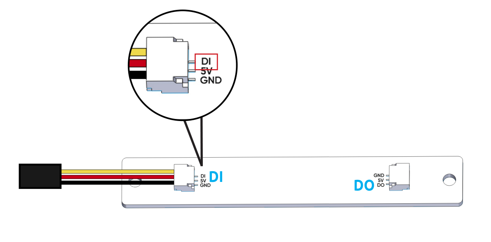

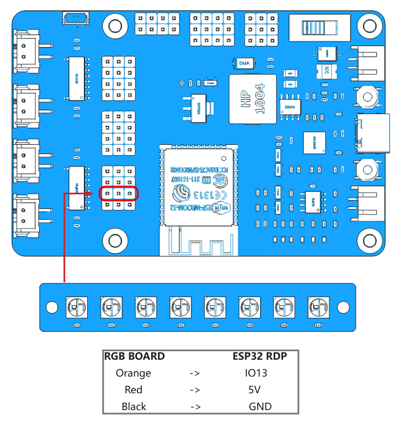

Run the ``4.flashingLight.ino`` file in the ``esp-4wd\Arduino\example\4.flashingLight`` path, the RGB light under the car flashes every 0.5 seconds and
changes color every time it flashes.

Test the servo
---------------

Finishing the wire up according to the diagram.

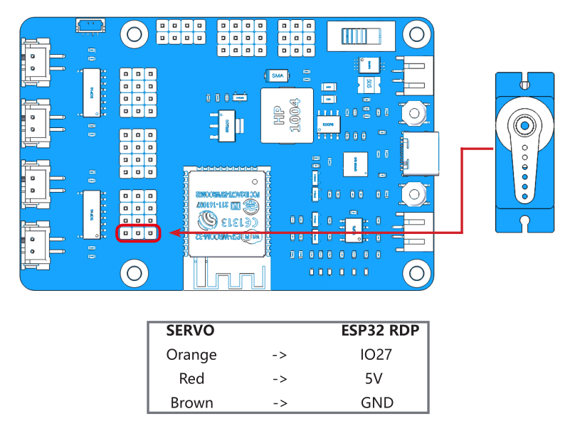

Run the ``Servo.ino`` file in the ``esp-4wd\Arduino\example\Servo`` path. The servo will first turn 30 degrees left, then 30 degrees right, and finally return to 0 degrees.

