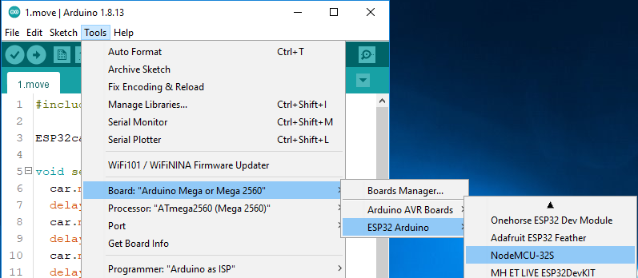

器件测试
=========

在组装ESP-4WD Car之前，你需要先对各类器件进行测试来确保它们是正常工作的，如果器件有任何问题，你可以对它们进行校准，或者联系我们更换新的器件。

连接电源
---------

Connect ESP32 RDP to PC.

.. image:: img/arduino_setup13.png
  :width: 400
  :align: center

用电池给ESP32 RDP供电。

.. image:: img/arduino_test1.jpg
  :width: 400
  :align: center

Test the motor
-----------------

Finishing the wire up according to the diagram.

.. image:: img/arduino_test2.png
  :width: 500
  :align: center

Open the 1.move.ino file in the esp-4wd\Arduino\example\1.move path.\(
你曾经在 `https://github.com/sunfounder/esp-4wd <https://github.com/sunfounder/esp-4wd>`_
下载过这些文件。如果没有这些文件，请重新下载它们。\)

select the Board and Port.
**(Board:ESP32 Arduino -> NodeMCU-32S)**

Compile and upload.

运行代码后，你会看到四个电机一直在转动，并且不断更换转动方向，最后停下来。

Test the ultrasonic module
---------------------------

Finishing the wire up according to the diagram.

.. image:: img/arduino_test3.png
  :width: 400
  :align: center

Run the 2.ultrasonic.ino file in the esp-4wd\Arduino\example\2.ultrasonic path. Click the icon in the upper 
right corner to open the serial debugging assistant, Set the baud rate to 115200.

.. image:: img/arduino_test3-1.png
  :width: 400
  :align: center

The serial port of arduino will always print the distance value read by the ultrasonic module.

Test the grayscale sensor module
---------------------------------

Finishing the wire up according to the diagram.

.. image:: img/arduino_test4.png
  :width: 400
  :align: center

Run the 3.grayValue.ino file in the esp-4wd\Arduino\example\3.grayValue path, the serial port of arduino will always print the reading value of the
grayscale sensor.

Grayscale sensor module通常会在白色地面上检测到1100以上的数值，在黑色地面上则会检测到900以下的数值，
在悬崖端会检测到110以下的数值。如果grayscale sensor module检测的数值不正常，你就需要对它进行校准。将grayscale sensor module放在白色地面上，用
螺丝刀顺时针扭动模块上的旋转按钮，使其检测到的值最大，然后将Grayscale sensor module放在黑色地面上，用螺丝刀逆时针扭动
模块上的模块上的旋转按钮，使其检测到的值最小，这样就完成了校准。

.. image:: img/arduino_test4-1.png
  :width: 400
  :align: center

Test the RGB board
--------------------

Finishing the wire up according to the diagram.

.. image:: img/arduino_test5.jpg
  :width: 400
  :align: center

.. image:: img/arduino_test6.png
  :width: 400
  :align: center

Run the 4.flashingLight.ino file in the esp-4wd\Arduino\example\4.flashingLight path, the RGB light under the car flashes every 0.5 seconds and
changes color every time it flashes.

Test the servo
---------------

Finishing the wire up according to the diagram.

.. image:: img/arduino_test7.png
  :width: 400
  :align: center

Run the Servo.ino file in the esp-4wd\Arduino\example\Servo path, 舵机将会先左转30度，然后右转30度，最后回到0度位置。保留这个0度位置不变，然后进行对ESP-4WD Car的组装。

