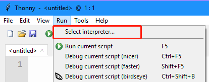

Setup Your Python
============================

Before you start using the kit, you need to complete the following steps.

Download the Files
--------------------

Go to `https://github.com/sunfounder/esp-4wd <https://github.com/sunfounder/esp-4wd>`_
download the ZIP files. Unzip the downloaded ZIP file and you will get the esp-4wd (esp-4wd-master) folder.

Install Python3
-----------------

Go to `https://www.python.org/downloads/ <https://www.python.org/downloads/>`_
. Select the proper version of Python 3 for your PC. Many Linux and Mac OS X computers 
should have Pyhon3 installed automatically.

Choose **Customize installation** when you complete installation.

.. image:: img/python_setup2.png
  :width: 400
  :align: center

Then click Next, check “Add Python to environment variables” in Advanced Options.

Download the burning firmware tool
------------------------------------

Open a Command Prompt (For windows users) or terminal (For Linux users).

.. image:: img/python_setup4.png
  :width: 350
  :align: center

Execute the following command to download esptool, a tool for burning firmware.

.. code::

    pip install esptool

Download the firmware
-----------------------

Go to `http://micropython.org/download/esp32/ <http://micropython.org/download/esp32/>`_
. Download the general firmware to a local folder, here is recommended to download 
**esp32-idf3-20200902-v1.13.bin**.

**NOTE:** 
If you are just starting with MicroPython, the best bet is to go for the Stable
firmware builds. If you are an advanced, experienced MicroPython ESP32 user who
would like to follow development closely and help with testing new features, there
are daily builds. If your board has SPIRAM support you can use either the standard
firmware or the firmware with SPIRAM support, and in the latter case you will have
access to more RAM for Python objects.

.. image:: img/python_setup5.png
  :width: 400
  :align: center

Install driver
---------------

Connect ESP32 RDP to PC.

.. image:: img/arduino_setup13.png
  :width: 400
  :align: center

Check your serial port information, right-click the "This PC" icon, Click Properties -> Device Manager -> Ports.

If the COM port information cannot be displayed, you need to install the CP210x driver.

.. image:: img/arduino_setup15.png
  :width: 250
  :align: center

Put the supporting CD into the computer CD drive, and then unzip the compressed package to a local folder.

After decompression, select the appropriate version to install.

Check the serial port information of the device manager again. If the COM port can be displayed, the installation is successful.

.. image:: img/arduino_setup18.png
  :width: 250
  :align: center

Erase and burn
---------------

Open the device manager and view the CMO port, where the ESP-4WD Car is
connected to COM12 of the computer.

Execute the following command to erase the flash of ESP32 RDP.

.. code::

    esptool.py --port COM12 erase_flash

After entering the path of the local folder, burn the firmware to the ESP-4WD Car.
(Note to modify the serial port information and firmware name)

.. code::

    esptool.py --chip esp32 --port COM12 write_flash -z 0x1000 esp32-idf3-20200902-v1.13.bin

Download Thonny
----------------

Thonny is an integrated development environment for running the python code that
controls the ESP-4WD Car. You can go to
`https://thonny.org/ <https://thonny.org/>`_ 
to download.

.. image:: img/python_setup7.png
  :width: 400
  :align: center

Open Thonny.

Select Language and Initial settings.

.. image:: img/python_setup9.png
  :width: 350
  :align: center

Upload file
------------

Click Run -> Select interpreter

First select **MicroPython (ESP32)** in the first drop-down box, and then select the
COM port in the second drop-down box that pops up.

.. image:: img/python_setup11.png
  :width: 500
  :align: center

Upload library file
^^^^^^^^^^^^^^^^^^^^^

Click View -> Files.

.. image:: img/python_setup12.png
  :width: 300
  :align: center

In the **This computer** area of the Files window on the left, find **esp32_rdp.py** files
and **ws.py** files (under the esp-4wd -> Micropython -> src path). Right-click on these
two python files and choose **Upload to /**.

.. image:: img/python_setup13.png
  :width: 300
  :align: center

Upload example files
^^^^^^^^^^^^^^^^^^^^^^

In the This computer window of the Files on the left, find 7 example files (under the
esp-4wd -> Micropython -> example path). Right-click on these nine python files and
choose **Upload to /**.

.. image:: img/python_setup14.png
  :width: 300
  :align: center

You can see the uploaded python file in the MicroPython device window.

.. image:: img/python_setup15.png
  :width: 300
  :align: center

    