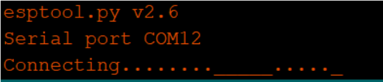
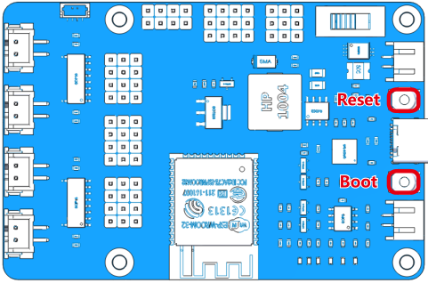
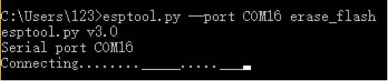
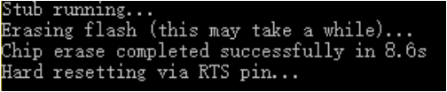

FAQ
====

In this chapter, we will answer the questions you may encounter when using ESP-4WD car.

**Q1:** When downloading arduino code, the serial port will not be connected for a long time.

**A:** This is because the transistor on the ESP32 RDP fails to reset the development board automatically, 
you need to reset the development board manually.

Manual reset method: When the serial port is connected, press the Reset button and the Boot button at 
the same time, release the Reset button first, and then release the Boot button. If the following message 
appears, it means the download is successful.

.. image:: img/faq3.png
  :width: 350

**Q2:** When erasing the flash of ESP32 RDP, the serial port will not be connected for a long time.

**A:** This is because the transistor on the ESP32 RDP fails to reset the development board automatically, 
you need to reset the development board manually. Please refer to Q1 for the reset method. If the 
following message appears, it means the erasure is complete.

**Q3:** When downloading programs related to controlling the movement of the car, the car moves abnormally.

**A:** This is because the power consumption of the ESP-4WD car motor is relatively large, and you need to 
replace a battery with sufficient power.

