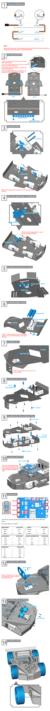

Hardware Assembling
====================

In this chapter, you will learn to assemble an ESP-4WD car. 
Before starting the assembly, please make sure that all components are operating normally and the servo is calibrated to the 0 degree.

