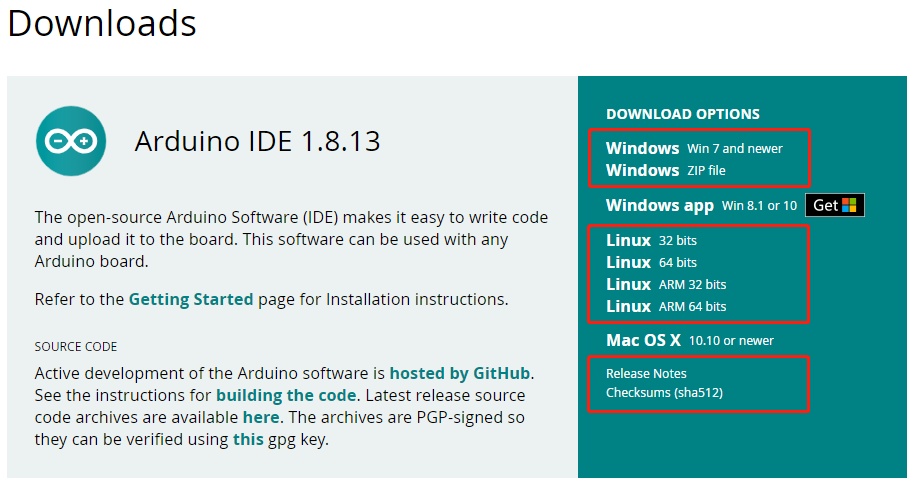

Preparations
================================

Before you start using the kit, you will need to complete the following steps.

Download the ESP-4WD Package
-------------------------------------

Click `here <https://github.com/sunfounder/esp-4wd>`_ to download the ESP-4WD codes. After unzipping the zip file you have downloaded, you will see all the relevant files for the ESP-4WD.

.. image:: img/arduino_setup2.png
  :width: 400
  :align: center

Install Arduino IDE
--------------------

Go to `Arduino Software Page <https://www.arduino.cc/en/software>`_ to download the Arduino IDE accordingly to your operating system，then follow the instructions to install it.

Add Libraries
----------------

Add esp_rdp
^^^^^^^^^^^^

Click Sketch -> Include Library -> Add .ZIP Library.

Select the **esp_rdp** library in the path of esp-4wd/Arduino, which you have downloaded before(https://github.com/sunfounder/esp-4wd), then click **OK**. After that you can call the functions in this library to control the esp-4wd car.

Add Adafruit NeoPixel
^^^^^^^^^^^^^^^^^^^^^^^^^^

Click **Sketch** -> **Include Library** -> **Manage Libraries**.

Type in **Adafruit NeoPixel**, find it on the scroll down page and click **Install**. When using the 8-bit RGB board, you will need to call the functions in this library.

Add WebSockets
^^^^^^^^^^^^^^^^^^^

Continue to add the **WebSockets** library from the **Library Manage** page. This library is used to open the APP control service.

Add ArduinoJson
^^^^^^^^^^^^^^^^^^^^

Continue to add the **ArduinoJson** library from the **Library Manage** page. This library is used for communication between the APP and the ESP-4WD car.

Installing ESP32 Add-on in Arduino IDE
-------------------------------------------
  
1. In your Arduino IDE, go to **File** -> **Preferences**.
  
.. image:: img/arduino_setup4.png
    :align: center
  
2. In the Preferences interface, click the **Upload** icon, and type in this URL, **https://dl.espressif.com/dl/package_esp32_index.json**, click OK.
  

  
.. note::
  
    If you already have the ESP8266 boards URL, you can separate the URLs with a comma as follows:
  
    https://dl.espressif.com/dl/package_esp32_index.json, http://arduino.esp8266.com/stable/package_esp8266com_index.json
  
  
3. Open the Boards Manager by clicking **Tools** -> **Board** -> **Boards Manager**. 
  

  
4. Search for **ESP32** and press install button for the **ESP32 by Espressif Systems**:
  

5. That’s it. If your network is poor, errors may be reported during the installation process, please click **Install** button again until the installation is successful.

Install Driver
---------------

When you connect the ESP32 RDP board to the computer with a Type-C USB cable, the computer may not be able to recognize it. In this case, you need to install the driver manually.
      
  .. image:: img/arduino_setup13_.png
    :width: 600
    :align: center
      
Right-click the **This PC** icon, and then click Properties -> Device Manager -> Ports to check the COM port information.    
    
  .. image:: img/arduino_setup14.png
      :align: center
      
If the COM port(COMxx) does not appear, you need to download `CP210x USB to UART Bridge VCP Drivers <https://www.silabs.com/developers/usb-to-uart-bridge-vcp-drivers>`_ and install it.    
  
  .. image:: img/arduino_setup15.png
    :align: center
  
Check the COM port information again. If the COM port(COMxx）can be displayed, the driver installation is successful.
      
  .. image:: img/arduino_setup18.png
    :align: center

    

