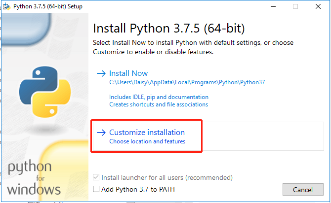
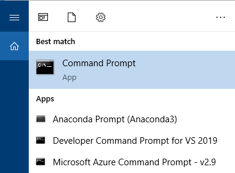
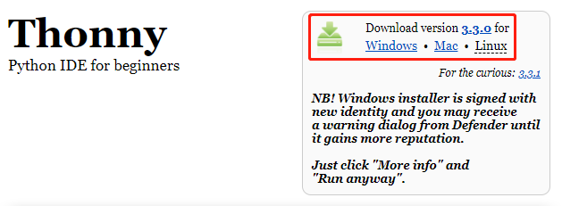
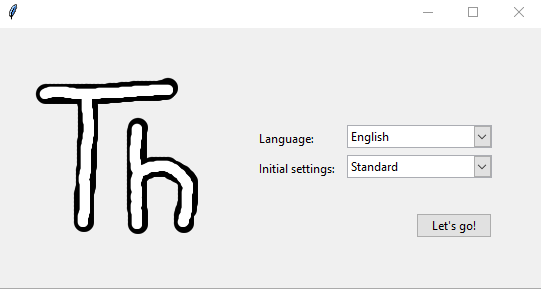
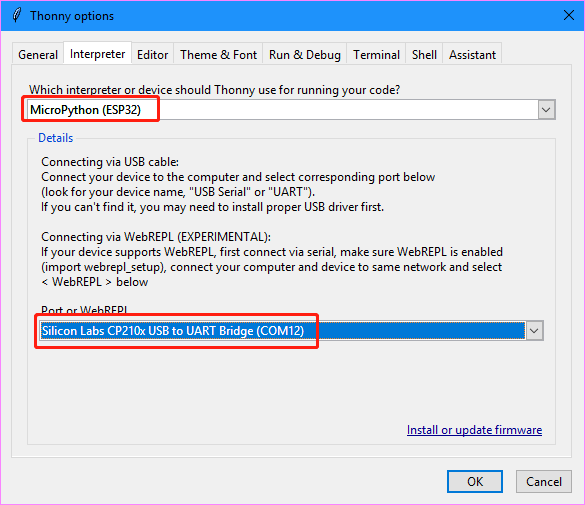
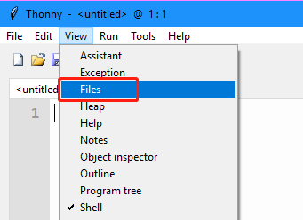
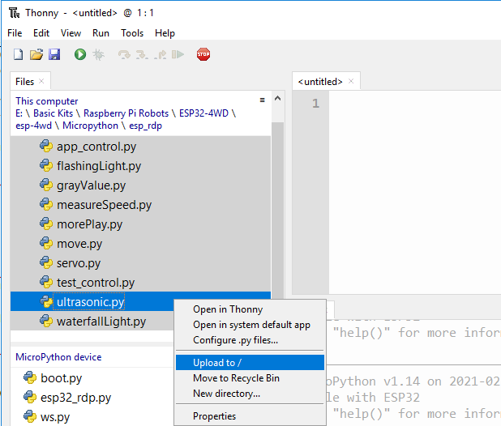
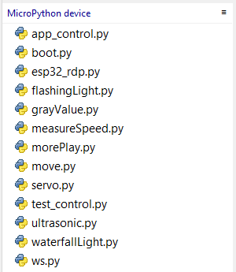

Preparations
============================

Before you start using the kit, you need to complete the following steps.

Burning Firmware
---------------------

Install Python3
^^^^^^^^^^^^^^^^^^^^^

Go to the `Python official website <https://www.python.org/downloads/>`_ and choose the version of python3 for your PC. Many Linux and Mac OS X computers should have Pyhon3 installed automatically.

.. image:: img/python_setup1.png
  :width: 400
  :align: center

Choose **Customize installation**.

Then click Next, check “Add Python to environment variables” in Advanced Options.

.. image:: img/python_setup3.png
  :width: 400
  :align: center

Download Firmware Burning Tool
^^^^^^^^^^^^^^^^^^^^^^^^^^^^^^^

Open a Command Prompt (For windows users) or terminal (For Linux users).

Execute the following command to download esptool, a tool for burning firmware.

.. code::

    pip install esptool

Download the Firmware
^^^^^^^^^^^^^^^^^^^^^^^^^

Go to the `MicroPython website <http://micropython.org/download/esp32/>`_. Download the general firmware to a local folder (The default path is C:/Users/username/Downloads), here is recommended to download 
**esp32-idf3-20200902-v1.13.bin**.

.. note::
  If you are just starting with MicroPython, then the best choice is to choose **Stable**
  Firmware version.If you are an experienced MicroPython ESP32 advanced user, you can try the **unstable** version.

.. image:: img/python_setup5.png
  :width: 400
  :align: center

Install Driver
^^^^^^^^^^^^^^^^^^^

When you connect the ESP32 RDP board to the computer with a Type-C USB cable, the computer may not be able to recognize it. In this case, you need to install the driver manually.
      
  .. image:: img/arduino_setup13_.png
    :width: 600
    :align: center
      
Right-click the **This PC** icon, and then click Properties -> Device Manager -> Ports to check the COM port information.    
    
  .. image:: img/arduino_setup14.png
      :align: center
      
If the COM port(COMxx) does not appear, you need to download `CP210x USB to UART Bridge VCP Drivers <https://www.silabs.com/developers/usb-to-uart-bridge-vcp-drivers>`_ and install it.    
  
  .. image:: img/arduino_setup15.png
    :align: center
  
Check the COM port information again. If the COM port(COMxx） can be displayed, the driver installation is successful.
      
  .. image:: img/arduino_setup18.png
    :align: center
  
Erase and Burn
^^^^^^^^^^^^^^^^^^^^^

Open the folder where you downloaded the firmware, the default path is C:/Users/username/Downloads, and execute the following command to erase the ESP32 RDP's flash.

.. code::

    esptool.py --port COM12 erase_flash

Then execute the following command to burn the firmware to the ESP32 RDP.

.. note::

  Change the COM port and firmware name to yours.

.. code::

    esptool.py --chip esp32 --port COM12 write_flash -z 0x1000 esp32-idf3-20200902-v1.13.bin

Download the ESP-4WD Package
------------------------------

Click `here <https://github.com/sunfounder/esp-4wd>`_ to download the ESP-4WD car kit codes. After unzipping the zip file you have downloaded, you will see all the relevant files for the ESP-4WD car kit.

.. image:: img/arduino_setup2.png
  :width: 300
  :align: center

Install Thonny
-----------------

Thonny is an integrated development environment for running the Micropython code that controls the ESP-4WD car. 

You can download it by visiting the `Thonny website <https://thonny.org/>`_. 
Once open the page, you will see a light gray box in the upper right corner, click on the link that applies to your operating system.

  

  
Open Thonny.
  
.. image:: img/python_setup8.png
  :align: center
  
Select Language and Initial settings.
  

Upload Files to ESP32 RDP.
----------------------------
  
Click **Run** -> Select **interpreter**.
  
.. image:: img/python_setup10.png
    :align: center
  
Select the interpreter **MicroPython (ESP32)** and then select COM port (the ESP32 RDP must be plugged into the computer first).

Click **View** -> **Files**.

Go to the folder where you store the downloaded ESP-4WD package, find the files ``esp32_rdp.py`` and ``ws.py`` under the path /esp-4wd/Micropython/esp_rdp/src, 
then select both files and right click on them to upload them to the MicroPython device.

.. image:: img/python_setup13.png
  :align: center

Use the same method to upload all Micropython files in the ``examples`` folder.
  

  
You can see the uploaded files in the MicroPython device window.
  

    