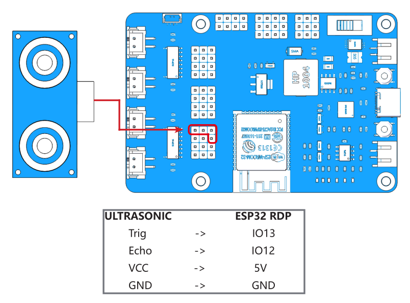
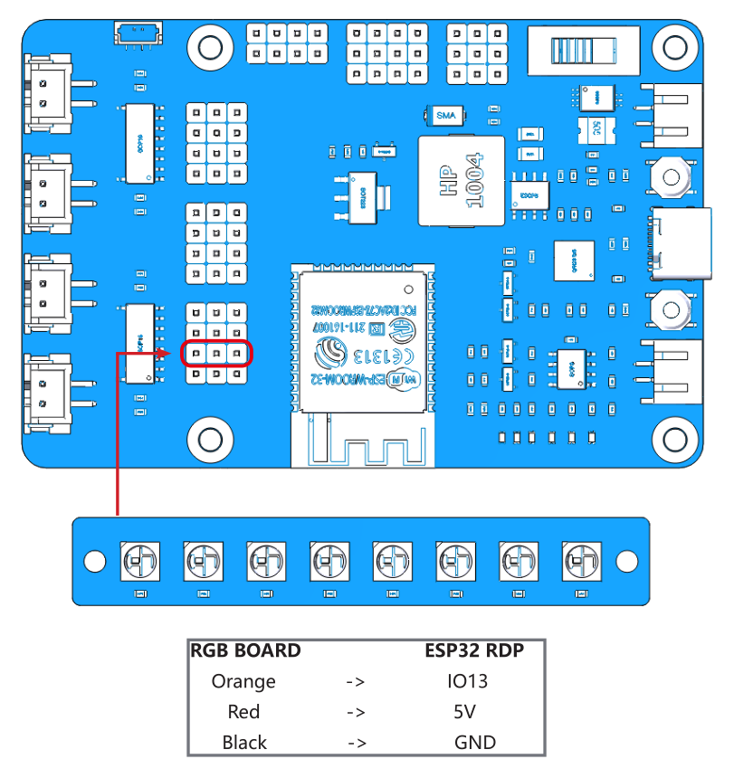

Test the Components with Arduino
================================

Before assembling the ESP-4WD car, you need to test each component to make sure it is working properly. If there are any problems with these components, please contact us.

* :ref:`arduino_power_to_esp_rdp`
* :ref:`arduino_test_the_motors`
* :ref:`arduino_test_the_ultrasonic_module`
* :ref:`arduino_test_the_grayscale_sensor_module`
* :ref:`arduino_test_the_rgb_board`
* :ref:`arduino_test_the_servo`
  
.. _arduino_power_to_esp_rdp:

Power to ESP32 RDP
---------------------------

In order to upload the code to the ESP32 RDP, you need to connect it to the computer with a Type-C USB cable.

.. image:: img/arduino_setup13_.png
  :width: 600
  :align: center

Then plug in the battery holder with two batteries to power other components and do not forget to slide the switch to ON.

.. image:: img/arduino_test1.jpg
  :width: 600
  :align: center

.. _arduino_test_the_motors:

Test the Motors
-----------------

Complete the wiring according to the diagram.

    .. image:: img/arduino_test2.png
      :align: center

Open the ``1.move.ino`` file under the path ``esp-4wd\Arduino\esp_rdp\examples\1.move``, you should have downloaded **esp-4wd** folder at `github <https://github.com/sunfounder/esp-4wd>`_ before.)

Select your Board in **Tools** > **Board** menu (ESP32 Arduino -> NodeMCU-32S), you need to scroll down several times to find it.

    .. image:: img/arduino_setup19.png
      :width: 800
      :align: center

Select the Port.

    .. image:: img/arduino_setup019.png
        :align: center

    .. note::
      
      If you can not see the COM port in the Arduino IDE, you need to check whether the `CP210x USB to UART Bridge VCP Drivers <https://www.silabs.com/developers/usb-to-uart-bridge-vcp-drivers>`_ is installed successfully, or plug in/out the USB cable multiple times.
  
Upload the code to the ESP32 RDP.

    .. image:: img/arduino_setup20.png
      :align: center

After the code upload is complete, you will see that the four motors are rotating and changing the direction of rotation, and finally stop.

.. _arduino_test_the_ultrasonic_module:

Test the Ultrasonic Module
---------------------------

Complete the wiring according to the diagram.

Upload the file ``2.ultrasonic.ino`` under the path ``esp-4wd\Arduino\esp_rdp\examples\2.ultrasonic``. 
Click the magnifier icon in the upper right corner to open the Serial Monitor and set the baudrate to 115200.

.. image:: img/arduino_test3-1.png
  :align: center

The Serial Monitor will print the distance value read by the ultrasonic module.

.. _arduino_test_the_grayscale_sensor_module:

Test the Grayscale Sensor Module
---------------------------------

Complete the wiring according to the diagram.

.. image:: img/arduino_test4.png
  :width: 600
  :align: center

After uploading the ``3.grayValue.ino`` file under the path ``esp-4wd\Arduino\esp_rdp\examples\3.grayValue``, the Serial Monitor will print the reading value of the grayscale sensor.

* Normally, it will detect a value above 1500 on white ground. 
* On black ground, it will detect values below 900. 
* On a cliff, it will detect a value below 110. 
* If the reading is 0, it means that the height of the detector is higher than its detection range.

If the grayscale sensor module does not detect normal values, you will need to calibrate it.
In order to make the calibrated value suitable for the assembled effect, the detector should be about **7mm** from the ground.

Now, Place it above the white ground and turn the potentiometer clockwise so that the reading is greater than 1100 (usually around 2000-4095). 

Then place it above the dark ground and turn the potentiometer counterclockwise to make it less than 900 (usually between 200 and 600). 
Repeat several times to get the maximum difference in both cases.

.. image:: img/arduino_test4-1_.png
  :width: 400
  :align: center

.. _arduino_test_the_rgb_board:

Test the RGB Board
-------------------------

Complete the wiring according to the diagram.

.. image:: img/arduino_test5.jpg
  :width: 500
  :align: center

After uploading the ``4.flashingLight.ino`` file under the path ``esp-4wd\Arduino\esp_rdp\examples\4.flashingLight``, the RGB board flashes every 0.5 seconds and changes color every time it flashes.

.. _arduino_test_the_servo:

Test the Servo
---------------

Complete the wiring according to the diagram.

.. image:: img/arduino_test7.png
  :width: 600
  :align: center

Insert a rocker arm into the servo shaft, then upload the ``servo.ino`` file under the path ``esp-4wd\Arduino\esp_rdp\examples\servo``, the servo will first turn left 30 degrees, then turn right 30 degrees, and finally back to 0 degrees.

.. note::
  In the process of assembling the car in the following chapter, the servo needs to be kept at 0 degrees, so please do not upload new codes on the ESP32 RDP until the part with the Servo is assembled.
