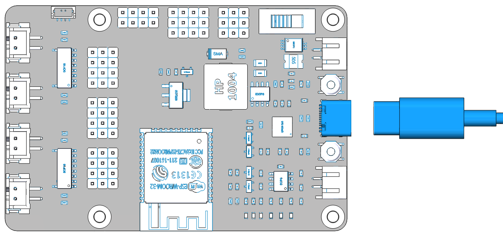
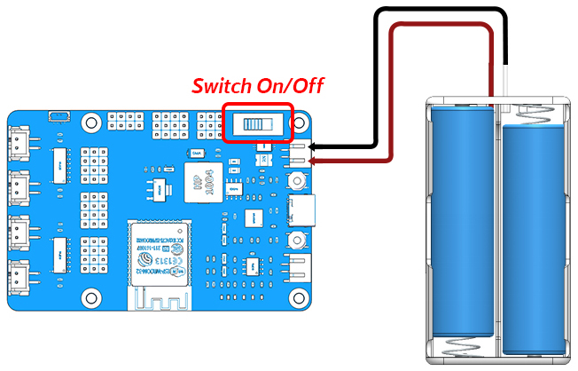
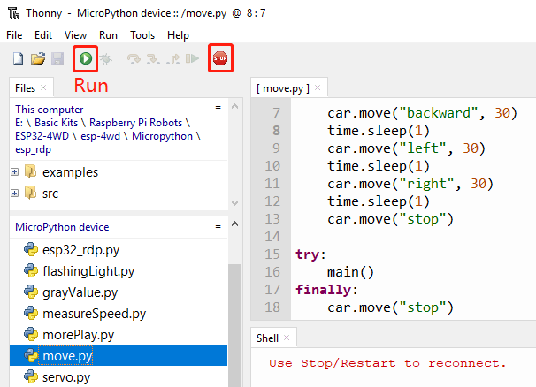
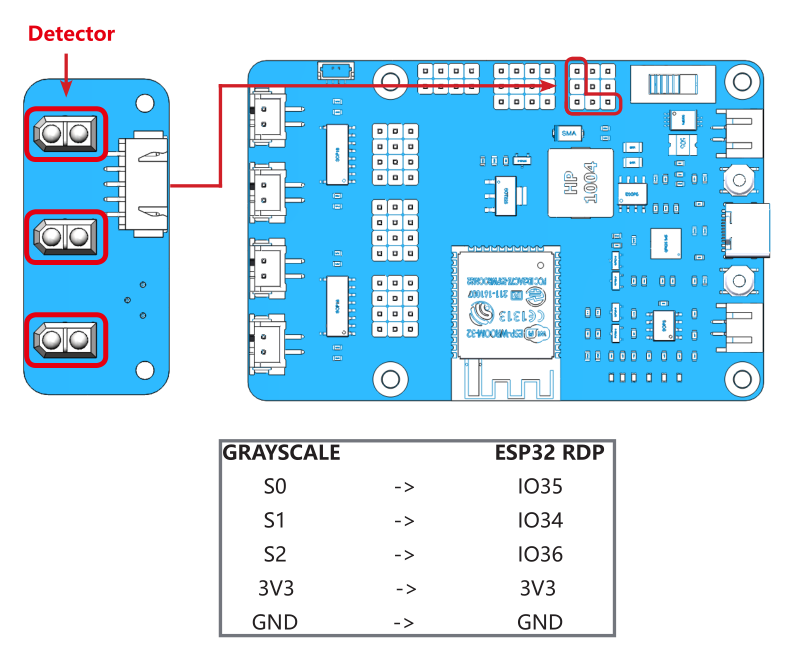
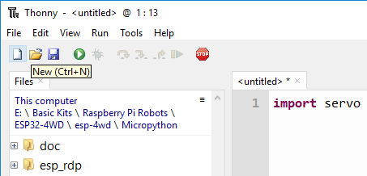
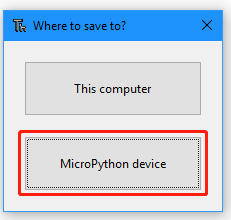
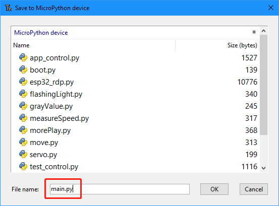

Test the Components with MicroPython
=======================================

Before assembling the ESP-4WD car, you need to test each component to make sure it is working properly. If there are any problems with these components, please contact us.

* :ref:`micropython_power_to_esp_rdp`
* :ref:`micropython_test_the_motors`
* :ref:`micropython_test_the_ultrasonic_module`
* :ref:`micropython_test_the_grayscale_sensor_module`
* :ref:`micropython_test_the_rgb_board`
* :ref:`micropython_test_the_servo`

.. _micropython_power_to_esp_rdp:

Power to ESP32 RDP
---------------------------

In order to upload the code to the ESP32 RDP, you need to connect it to the computer with a Type-C USB cable.

Then plug in the battery holder with two batteries to power other components and do not forget to slide the switch to ON.

.. _micropython_test_the_motors:

Test the Motors
-----------------

Complete the wiring according to the diagram.

.. image:: img/arduino_test2.png
  :width: 600
  :align: center

Double-click the ``move.py`` file in the MicroPython device window.

Click the **green play** icon at the top left to run the current script, and then click the **STOP** icon to Stop/Restart backend.

After running the code, you will see the four motors rotate and change the direction of rotation, and finally stop.

.. _micropython_test_the_ultrasonic_module:

Test the Ultrasonic Module
---------------------------

Complete the wiring according to the diagram.

.. image:: img/arduino_test3.png
  :width: 600
  :align: center

Run ``ultrasonic.py``, the Shell window under Thonny will always print the distance value read
by the ultrasonic module.

.. image:: img/python_setup17.png
  :width: 600
  :align: center

.. _micropython_test_the_grayscale_sensor_module:

Test the Grayscale Sensor Module
---------------------------------

Complete the wiring according to the diagram.

Run ``grayValue.py``, the Shell window under Thonny will always print the reading value of the
grayscale sensor.

* Normally, it will detect a value above 1500 on white ground. 
* On black ground, it will detect values below 900. 
* On a cliff, it will detect a value below 110. 
* If the reading is 0, it means that the height of the detector is higher than its detection range.
  
If the grayscale sensor module does not detect normal values, you will need to calibrate it.
In order to make the calibrated value suitable for the assembled effect, the detector should be about **7mm** from the ground.

Now, Place it above the white ground and turn the potentiometer clockwise so that the reading is greater than 1500 (usually between 2000-4095). 
Then place it above the dark ground and turn the potentiometer counterclockwise to make it less than 900 (usually between 300 and 600). 
Repeat several times to get the maximum difference in both cases.

.. image:: img/arduino_test4-1_.png
  :width: 400
  :align: center

.. _micropython_test_the_rgb_board:

Test the RGB Board
--------------------

Complete the wiring according to the diagram.

.. image:: img/arduino_test5.jpg
  :width: 400
  :align: center

.. image:: img/arduino_test6.png
  :width: 600
  :align: center

Run ``flashingLight.py``, the RGB light under the car flashes every 0.5 seconds and changes color every time it flashes.

.. _micropython_test_the_servo:

Test the Servo
---------------

Complete the wiring according to the diagram.

.. image:: img/arduino_test7.png
  :width: 600
  :align: center

Insert a rocker arm into the servo shaft, then run ``servo.py``. the servo will first turn left 30 degrees, then turn right 30 degrees, and finally back to 0 degrees.
  
.. note::

  In the car assembly process in the next chapter, the servo must be kept at 0 degrees. Here, we provide a way to make ESP32 RDP run Servo.py automatically when power on. 

Click the new file icon in the upper left corner.

Enter the following code.

.. code-block:: python

  import servo

.. note::
  You can replace servo with the name of other example code, depending on which code you want to run automatically when power is on.

Click the save button in the upper left corner, and select **MicroPython device** in the pop-up option box. 

Name the file **main.py** .

Unplug the data cable and re-power the main control board. **main.py** will run automatically.